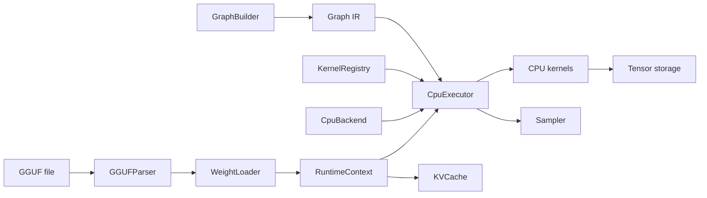

# MiniLLMEngine

MiniLLMEngine is a C++23 CPU-first LLM inference engine built as a compact AI infrastructure project. It implements the core pieces of a modern local inference runtime: tensor metadata, graph IR, shape inference, CPU kernel dispatch, GGUF parsing, weight loading, sampling, and KV cache based generation.

The goal is not to clone llama.cpp. The goal is to show the engineering ideas behind an inference engine in a smaller codebase that is easy to read, test, explain, and extend.

## Highlights

- **C++23 inference runtime** with strongly typed graph IDs, `std::expected` error handling, and a small public umbrella header.
- **Graph IR + executor** with `Value`, `Node`, `GraphBuilder`, topological sort, backend capability checks, and runtime tensor binding.
- **CPU backend** for FP32 kernels including `Linear`, `MatMul`, `RMSNorm`, `QKNorm`, `RoPE`, `Attention`, `Softmax`, `SwiGLU`, `Embedding`, `Transpose`, and `Reshape`.
- **KV cache flow** for single-batch prefill/decode, including executor-driven cache length advancement.
- **GGUF support** for metadata parsing, tensor table reading, F32/F16/BF16 weight loading, and common Llama/Qwen weight-name mapping.
- **Testing and benchmarks** with CTest, kernel reference tests, executor integration tests, and a CPU GEMM benchmark.

## Architecture



## What Is Implemented

| Area | Status |
|------|--------|
| Tensor / Shape / DType / Device | Implemented |
| Graph IR / GraphBuilder / shape inference | Implemented |
| CPU executor and kernel registry | Implemented |
| FP32 CPU kernels | Implemented for core transformer ops |
| GGUF metadata and tensor loading | Implemented for F32/F16/BF16 |
| Byte-level BPE tokenizer | Experimental |
| KV cache prefill/decode | Implemented for single-batch generation |
| CPU benchmark harness | Implemented |
| Quantized kernels | Not yet |
| CUDA / Metal / Vulkan | Out of scope |
| Continuous batching / server runtime | Out of scope |

## Quick Start

Requirements:

- CMake 3.22+
- C++23 compiler, such as GCC 13+, Clang 17+, or MSVC 19.35+

Build:

```bash
cmake -B build -DCMAKE_BUILD_TYPE=Debug
cmake --build build -j
```

Run all tests:

```bash
ctest --test-dir build --output-on-failure
```

Run examples:

```bash
./build/build_tiny_llama_graph
./build/forward_tiny_llama
./build/forward_tiny_llama_gguf /path/to/model.gguf
./build/generate /path/to/model.gguf "Hello"
```

## CPU Benchmark

`benchmark_cpu` measures the GEMM paths used by the CPU backend.

```bash
./build/benchmark_cpu [M] [N] [K] [iters]
```

The `sgemm_nt` case matches the common transformer Linear layout:

```text
A[M,K] x W[N,K]^T -> C[M,N]
```

Example smoke run from a Debug build:

```text
./build/benchmark_cpu 1 512 512 5
sgemm_nt     shape=[1,512,512] iters=5 avg_ms=0.0750 gflops=6.99
sgemm        shape=[1,512,512] iters=5 avg_ms=0.1473 gflops=3.56
```

Use `-DCMAKE_BUILD_TYPE=Release` for meaningful performance numbers.

## Tests

CTest currently runs:

```bash
./build/test_shape
./build/test_tensor
./build/test_graph
./build/test_graph_builder
./build/test_runtime
./build/test_cpu_kernels
./build/test_gguf_parser
```

The test suite covers:

- shape and tensor allocation behavior
- graph construction and validation
- CPU executor integration
- CPU kernel numerical reference checks
- KV cache prefill/decode advancement
- GGUF parser and weight conversion helpers

## Project Layout

```text
include/minillm/
  core/        Tensor, Shape, DType, Device, Status
  graph/       Graph IR, Node, Value, attributes, shape inference
  runtime/     Backend, executor, CPU kernels, KV cache, sampler
  io/          GGUF parser, weight loader, tokenizer
  model/       Transformer graph builder

src/
  core/        Core runtime data structures
  graph/       Graph implementation and builder logic
  runtime/     CPU backend and execution path
  io/          GGUF and tokenizer implementation
  model/       Decoder-only graph construction

examples/      CLI demos and benchmark
tests/         Unit and integration tests
docs/          Design notes
```

## Design Notes

For a deeper explanation of the architecture, see [docs/design.md](docs/design.md).

Key design choices:

- `Value` is a logical tensor descriptor. `Tensor` owns or references runtime storage.
- `GraphBuilder` performs shape inference when building nodes.
- `CpuExecutor` validates backend support, resolves kernels through `KernelRegistry`, and runs nodes in topological order.
- `RuntimeContext` binds `ValueId` to runtime `Tensor` objects and owns intermediate tensors.
- `KVCache` is shared between prefill and decode contexts and is advanced once after a successful graph run.

## References

This project is an independent learning implementation inspired by:

- [llama.cpp / ggml](https://github.com/ggml-org/llama.cpp)
- [Genllm](https://github.com/Aimol-l/Genllm)
- [mini_op](https://github.com/plutoaac/mini_op)

## Roadmap

Near-term work with high portfolio value:

- Run and document an end-to-end Qwen3-0.6B GGUF demo.
- Add a Release-mode benchmark table for prefill/decode and GEMM shapes.
- Add a simple memory planner for intermediate tensor reuse.
- Implement the first quantized weight path, likely `Q8_0`.
- Add a short CLI-focused demo script for interviews.

Longer-term experiments:

- More optimized GEMM micro-kernels and weight packing.
- Multi-threaded CPU execution.
- Prefix cache and multi-sequence KV cache management.
- Minimal streaming HTTP API.
