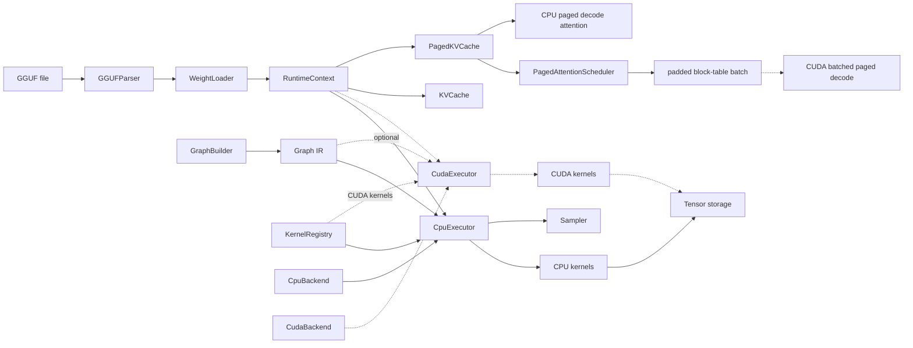

# MiniLLMEngine

MiniLLMEngine is a C++23 CPU-first LLM inference engine built as a compact AI infrastructure project. It implements the core pieces of a modern local inference runtime: tensor metadata, graph IR, shape inference, CPU kernel dispatch, optional CUDA kernel dispatch, GGUF parsing, weight loading, sampling, and KV cache based generation.

The goal is not to clone llama.cpp. The goal is to show the engineering ideas behind an inference engine in a smaller codebase that is easy to read, test, explain, and extend.

## Highlights

- **C++23 inference runtime** with strongly typed graph IDs, `std::expected` error handling, and a small public umbrella header.
- **Graph IR + executor** with `Value`, `Node`, `GraphBuilder`, topological sort, backend capability checks, and runtime tensor binding.
- **CPU backend** for FP32 kernels including `Linear`, `MatMul`, `RMSNorm`, `QKNorm`, `RoPE`, `Attention`, `Softmax`, `SwiGLU`, `Embedding`, `Transpose`, and `Reshape`.
- **Optional CUDA backend** behind `MINILLM_ENABLE_CUDA`, with FP32 kernels for the same core transformer operator set and a separate `CudaExecutor` path.
- **KV cache flow** for single-batch prefill/decode, including executor-driven cache length advancement.
- **Paged KV cache reference** inspired by vLLM PagedAttention, with block tables, free-block reuse, a small multi-sequence scheduler, CPU decode attention, and CUDA paged decode over device block tables.
- **Graph memory planner** with liveness analysis, O(n log n) best-fit buffer reuse, contiguous CPU arena pools, and peak-memory reporting.
- **GGUF support** for bounds-checked metadata parsing, tensor table reading, F32/F16/BF16 weight loading, shared prefill/decode weight storage, tied-embedding aliases, and common Llama/Qwen weight-name mapping.
- **Testing and benchmarks** with CTest, kernel reference tests, executor integration tests, and a CPU GEMM benchmark.

## Architecture



## What Is Implemented

| Area | Status |
|------|--------|
| Tensor / Shape / DType / Device | Implemented |
| Graph IR / GraphBuilder / shape inference | Implemented |
| CPU executor and kernel registry | Implemented |
| FP32 CPU kernels | Implemented for core transformer ops |
| Optional CUDA executor/backend | Experimental, disabled by default |
| FP32 CUDA kernels | Implemented with CUDA correctness tests |
| Graph memory planner | Implemented for CPU intermediates, with O(n log n) matching and contiguous arena binding |
| GGUF metadata and tensor loading | Implemented for F32/F16/BF16, with parser safety checks and shared weight storage |
| Byte-level BPE tokenizer | Experimental |
| KV cache prefill/decode | Implemented for single-batch generation |
| Paged KV cache / PagedAttention reference | Implemented for CPU decode and toy multi-sequence scheduling |
| CPU benchmark harness | Implemented |
| Quantized kernels | Not yet |
| CUDA PagedAttention decode | Implemented for single-sequence and batched decode |
| CUDA quantized kernels | Not yet |
| Metal / Vulkan | Out of scope |
| Continuous batching / server runtime | Out of scope |

## Quick Start

Requirements:

- CMake 3.22+
- C++23 compiler, such as GCC 13+, Clang 17+, or MSVC 19.35+

Build:

```bash
cmake -B build -DCMAKE_BUILD_TYPE=Debug
cmake --build build -j
```

Optional CUDA build:

```bash
cmake -B build-cuda -DCMAKE_BUILD_TYPE=Release -DMINILLM_ENABLE_CUDA=ON
cmake --build build-cuda -j
```

CUDA is off by default. The normal build remains CPU-only and does not require a CUDA toolkit or GPU. The CUDA build defaults to `sm_86` for Ampere GPUs such as RTX 30-series; pass `-DCMAKE_CUDA_ARCHITECTURES=...` to target another GPU.

Run all tests:

```bash
ctest --test-dir build --output-on-failure
```

Run examples:

```bash
./build/build_tiny_llama_graph
./build/forward_tiny_llama
./build/forward_tiny_llama_gguf /path/to/model.gguf
./build/generate /path/to/model.gguf "Hello"
./build-cuda/forward_tiny_llama_gguf_cuda /path/to/model.gguf
./build-cuda/generate_cuda /path/to/model.gguf "Hello" 2
```

## CUDA Status

CUDA support is an optional experimental module, inspired by the operator structure in `mini_op` but integrated through MiniLLMEngine's own graph runtime:

- `CudaBackend` declares backend capability.
- `CudaExecutor` mirrors the CPU executor and dispatches `(DeviceType::CUDA, OpType)` kernels.
- `register_cuda_kernels()` bridges graph nodes to `.cu` launch wrappers.
- `Tensor::allocate_cuda()` owns CUDA device memory while preserving the same runtime `Tensor` API.
- `WeightLoader` can stage F32/F16/BF16 GGUF weights through CPU memory and copy them into CUDA tensors.
- `SharedWeightStore` loads each GGUF tensor once and binds the same weight tensors into prefill and decode contexts.
- `KVCache::init_cuda()` stores contiguous decode K/V cache on device and lets CUDA Attention run prefill/decode.

Implemented CUDA operators currently target FP32 inference: `Embedding`, `Linear`, `MatMul`, `RMSNorm`, `QKNorm`, `Add`, `Mul`, `SiLU`, `SwiGLU`, `RoPE`, no-cache `Attention`, single-sequence and batched PagedAttention-style decode, `Softmax`, `Reshape`, and `Transpose`.

`test_cuda_kernels` validates raw CUDA kernels against CPU references and also checks a small `CudaExecutor` graph with `Linear` + bias.

`forward_tiny_llama_gguf_cuda` is a real GPU smoke test for GGUF models: it builds the transformer graph on `Device::cuda(0)`, loads GGUF weights into CUDA tensors, runs a no-cache forward pass, and copies logits back for validation.

`generate_cuda` extends that path to single-batch generation with a CUDA contiguous KV cache. It runs prompt prefill, advances the shared cache once per graph run, then decodes one token at a time on GPU while sampling on CPU from copied logits.

The CUDA path does not yet include quantized CUDA matmul, production scheduler policies, CUDA paged-cache integration in the full generation loop, or memory-planner-backed CUDA arena allocation.

## Paged KV Cache

`PagedKVCache` is a compact reference implementation of the core idea behind PagedAttention:

- K/V memory is split into fixed-size token blocks.
- each sequence owns a block table that maps logical token positions to physical blocks.
- freed sequences return blocks to a reusable free list.
- `PagedAttentionScheduler` keeps a small active sequence set and emits padded batch metadata: sequence IDs, sequence lengths, and flattened block tables.
- `paged_attention_decode()` reads K/V through the block table and supports GQA.
- `cuda::paged_attention_decode()` runs the same decode pattern on device-resident K/V pages and a device block table.
- `cuda::paged_attention_decode_batch()` consumes scheduler-style batch metadata and decodes multiple active sequences in one launch.

The scheduler is intentionally small: it is not a production request queue, but it demonstrates the core bridge between paged KV allocation and batched GPU decode.

## CPU Benchmark

`benchmark_cpu` measures the GEMM paths used by the CPU backend.

```bash
./build/benchmark_cpu [M] [N] [K] [iters]
```

The `sgemm_nt` case matches the common transformer Linear layout:

```text
A[M,K] x W[N,K]^T -> C[M,N]
```

Example smoke run from a Debug build:

```text
./build/benchmark_cpu 1 512 512 5
sgemm_nt     shape=[1,512,512] iters=5 avg_ms=0.0750 gflops=6.99
sgemm        shape=[1,512,512] iters=5 avg_ms=0.1473 gflops=3.56
```

Use `-DCMAKE_BUILD_TYPE=Release` for meaningful performance numbers.

## Tests

CTest currently runs:

```bash
./build/test_shape
./build/test_tensor
./build/test_graph
./build/test_graph_builder
./build/test_runtime
./build/test_cpu_kernels
./build/test_memory_planner
./build/test_paged_kv_cache
./build/test_paged_attention_scheduler
./build/test_gguf_parser
./build/test_transformer_graph_builder
./build/test_bpe_tokenizer
```

CUDA builds add:

```bash
./build-cuda/test_cuda_kernels
```

The test suite covers:

- shape and tensor allocation behavior
- graph construction and validation
- CPU executor integration
- CPU kernel numerical reference checks
- graph liveness, memory reuse planning, and CPU arena binding
- transformer graph weight naming and RoPE metadata propagation
- tokenizer boundary behavior and GGUF parser safety checks
- KV cache prefill/decode advancement
- paged KV block allocation, scheduler batch metadata, and paged decode attention
- CUDA elementwise, GEMM, norm, RoPE, softmax, transpose, SDPA, single/batched paged decode, and executor dispatch
- GGUF parser and weight conversion helpers
- GGUF CUDA forward smoke path through `forward_tiny_llama_gguf_cuda`
- CUDA single-batch GGUF generation smoke path through `generate_cuda`

## Project Layout

```text
include/minillm/
  core/        Tensor, Shape, DType, Device, Status
  graph/       Graph IR, Node, Value, attributes, shape inference
  runtime/     Backend, executor, CPU/CUDA kernels, KV cache, paged KV cache, sampler
  io/          GGUF parser, weight loader, tokenizer
  model/       Transformer graph builder

src/
  core/        Core runtime data structures
  graph/       Graph implementation and builder logic
  runtime/     CPU backend, optional CUDA backend, and execution paths
  io/          GGUF and tokenizer implementation
  model/       Decoder-only graph construction

examples/      CLI demos and benchmark
tests/         Unit and integration tests
docs/          Design notes
```

## Design Notes

For a deeper explanation of the architecture, see [docs/design.md](docs/design.md).

Key design choices:

- `Value` is a logical tensor descriptor. `Tensor` owns or references runtime storage.
- `GraphBuilder` performs shape inference when building nodes.
- `CpuExecutor` validates backend support, resolves kernels through `KernelRegistry`, and runs nodes in topological order.
- `CudaExecutor` mirrors the CPU executor when the project is built with `MINILLM_ENABLE_CUDA=ON`.
- `RuntimeContext` binds `ValueId` to runtime `Tensor` objects and owns intermediate tensors.
- `KVCache` is shared between prefill and decode contexts and is advanced once after a successful graph run.
- `SharedWeightStore` lets prefill and decode contexts reuse one loaded GGUF weight set instead of duplicating model parameters.
- `PagedKVCache` separates logical sequence positions from physical KV blocks; `PagedAttentionScheduler` turns several active sequences into padded block-table batches.
- `MemoryPlanner` computes intermediate tensor live ranges; `RuntimeContext::allocate_intermediates_planned()` binds non-overlapping CPU intermediates to shared arena buffers.
- CUDA currently covers FP32 operator dispatch, tensor allocation, GGUF weight staging to device tensors, contiguous CUDA KV cache generation, and raw paged decode kernels. CUDA graph-memory arena integration, production batching policy, full paged-cache generation, and quantized CUDA matmul are intentionally left as future work.

## References

This project is an independent learning implementation inspired by:

- [llama.cpp / ggml](https://github.com/ggml-org/llama.cpp)
- [Genllm](https://github.com/Aimol-l/Genllm)
- [mini_op](https://github.com/plutoaac/mini_op)

## Roadmap

Near-term work with high portfolio value:

- Run and document end-to-end Qwen3-0.6B CPU and CUDA generation smoke demos.
- Add a Release-mode benchmark table for prefill/decode and GEMM shapes.
- Add Release-mode activation-memory and prefill/decode benchmark tables.
- Add Release-mode CUDA benchmark numbers for the tested FP32 kernels.
- Connect `PagedAttentionScheduler` to a real decode loop with request admission and finished-sequence eviction.
- Implement the first quantized weight path, likely `Q8_0`.
- Add a short CLI-focused demo script for interviews.

Longer-term experiments:

- More optimized GEMM micro-kernels and weight packing.
- Multi-threaded CPU execution.
- Prefix cache, continuous batching, and multi-sequence scheduling.
- Minimal streaming HTTP API.
