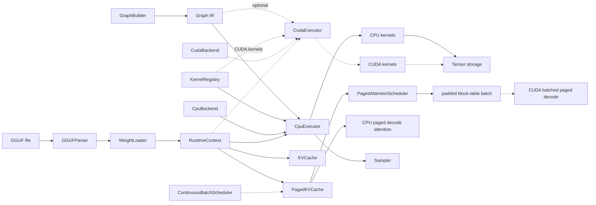

# MiniLLMEngine

MiniLLMEngine is a compact C++23 CPU-first LLM inference project built for clarity. It implements the core pieces of a local inference runtime: tensor metadata, graph IR, shape inference, CPU kernel dispatch, optional CUDA kernel dispatch, GGUF parsing, weight loading, sampling, and KV cache based generation.

The goal is not to clone llama.cpp. The goal is to show the engineering ideas behind an inference engine in a smaller codebase that is easy to read, test, explain, and extend, with a shape that is friendly for internships and portfolio review.

## Highlights

- **C++23 inference runtime** with strongly typed graph IDs, `std::expected` error handling, and a small public umbrella header.
- **Graph IR + executor** with `Value`, `Node`, `GraphBuilder`, topological sort, backend capability checks, and runtime tensor binding.
- **CPU backend** for FP32 kernels including `Linear`, `MatMul`, `RMSNorm`, `QKNorm`, `RoPE`, `Attention`, `Softmax`, `SwiGLU`, `Embedding`, `Transpose`, and `Reshape`.
- **FlashAttention-style CPU attention** with tiled K/V traversal, online softmax, and a benchmark against the naive SDPA path.
- **Optional CUDA backend** behind `MINILLM_ENABLE_CUDA`, with FP32 kernels for the same core transformer operator set and a separate `CudaExecutor` path.
- **KV cache flow** for single-batch prefill/decode, including executor-driven cache length advancement.
- **Paged KV cache** with vLLM-style block tables, free-block reuse, CPU decode attention, multi-sequence scheduler, and CUDA device memory + paged decode over device block tables.
- **Continuous batching scheduler** with waiting→prefilling→decoding→finished lifecycle, auto-assigned sequence IDs, and KV block eviction/reuse.
- **Graph memory planner** with liveness analysis, O(n log n) best-fit buffer reuse, contiguous CPU arena pools, and peak-memory reporting.
- **GGUF support** for bounds-checked metadata parsing, mmap-backed tensor byte views, F32/F16/BF16/Q8_0 weight loading, shared prefill/decode weight storage, tied-embedding aliases, and common Llama/Qwen weight-name mapping.
- **BPE tokenizer** (ported from Genllm) with GPT-2 byte-to-unicode mapping, full regex pre-tokenization state machine, added-token longest-match, and `<0xHH>` byte token decoding.
- **Testing and benchmarks** with CTest, kernel reference tests, executor integration tests, and CPU GEMM/FlashAttention benchmarks.
- **Code quality** with `TRY`/`TRY_TENSOR` macros eliminating ~50 boilerplate error-propagation if-statements, and `kernel_adapter_common.h` deduplicating ~95 lines of shared adapter helpers.

## Architecture



## What Is Implemented

| Area | Status |
|------|--------|
| Tensor / Shape / DType / Device | Implemented |
| Graph IR / GraphBuilder / shape inference | Implemented |
| CPU executor and kernel registry | Implemented |
| FP32 CPU kernels | Implemented for core transformer ops |
| CPU FlashAttention-style SDPA | Implemented for prefill and decode reference paths |
| Optional CUDA executor/backend | Experimental, disabled by default |
| FP32 CUDA kernels | Implemented with CUDA correctness tests |
| Graph memory planner | Implemented for CPU intermediates, with O(n log n) matching and contiguous arena binding |
| GGUF metadata and tensor loading | Implemented for F32/F16/BF16, with parser safety checks and shared weight storage |
| Byte-level BPE tokenizer | Implemented (Genllm port) with GPT-2 pre-tokenization, merge-based BPE, and `<0xHH>` byte token support |
| KV cache prefill/decode | Implemented for single-batch generation |
| Paged KV cache / PagedAttention | CPU: implemented. CUDA: device memory + block table upload + adapter integration complete. |
| CUDA PagedAttention decode | Single-sequence and batched decode via `cuda::paged_attention_decode[_batch]`, wired through adapter |
| Continuous batching scheduler | Lifecycle core implemented; real inference-loop integration in progress |
| CPU benchmark harness | Implemented |
| Quantized kernels | Not yet |
| CUDA PagedAttention decode | Implemented for single-sequence and batched decode |
| CUDA quantized kernels | Not yet |
| Metal / Vulkan | Out of scope |

## Quick Start

Requirements:

- CMake 3.22+
- C++23 compiler, such as GCC 13+, Clang 17+, or MSVC 19.35+

Build:

```bash
cmake -B build -DCMAKE_BUILD_TYPE=Debug
cmake --build build -j
```

Optional CUDA build:

```bash
cmake -B build-cuda -DCMAKE_BUILD_TYPE=Release -DMINILLM_ENABLE_CUDA=ON
cmake --build build-cuda -j
```

CUDA is off by default. The normal build remains CPU-only and does not require a CUDA toolkit or GPU. The CUDA build defaults to `sm_86` for Ampere GPUs such as RTX 30-series; pass `-DCMAKE_CUDA_ARCHITECTURES=...` to target another GPU.

Run all tests:

```bash
ctest --test-dir build --output-on-failure
```

Run examples:

```bash
./build/generate /path/to/model.gguf "Hello"
./build/generate_paged /path/to/model.gguf 32
./build/benchmark_cpu 1 512 512 5
./build/benchmark_flash_attention 2 8
./build-cuda/generate_cuda /path/to/model.gguf "Hello" 2
```

## llama.cpp Alignment Check

To compare MiniLLMEngine against `llama.cpp` on the same Qwen3 prompt, use the
alignment helper:

```bash
python3 scripts/compare_llama_completion.py /path/to/Qwen3-0.6B-BF16.gguf "Hello" 32
```

It uses the raw chat prompt with the empty `<think></think>` block and the same
deterministic greedy decoding settings as the comparison path in `generate`.
That keeps the prompt shape and sampling behavior close to `llama-completion`
for end-to-end verification.

## CUDA Status

CUDA support is an optional experimental module, inspired by the operator structure in `mini_op` but integrated through MiniLLMEngine's own graph runtime:

- `CudaBackend` declares backend capability.
- `CudaExecutor` mirrors the CPU executor and dispatches `(DeviceType::CUDA, OpType)` kernels.
- `register_cuda_kernels()` bridges graph nodes to `.cu` launch wrappers.
- `Tensor::allocate_cuda()` owns CUDA device memory while preserving the same runtime `Tensor` API.
- `WeightLoader` can stage F32/F16/BF16 GGUF weights through CPU memory and copy them into CUDA tensors.
- `SharedWeightStore` loads each GGUF tensor once and binds the same weight tensors into prefill and decode contexts.
- `KVCache::init_cuda()` stores contiguous decode K/V cache on device and lets CUDA Attention run prefill/decode.

Implemented CUDA operators currently target FP32 inference: `Embedding`, `Linear`, `MatMul`, `RMSNorm`, `QKNorm`, `Add`, `Mul`, `SiLU`, `SwiGLU`, `RoPE`, no-cache `Attention`, single-sequence and batched PagedAttention-style decode, `Softmax`, `Reshape`, and `Transpose`.

`test_cuda_kernels` validates raw CUDA kernels against CPU references and also checks a small `CudaExecutor` graph with `Linear` + bias.

`generate_cuda` is the current GPU smoke path for GGUF models. It builds the transformer graph on `Device::cuda(0)`, loads GGUF weights into CUDA tensors, runs prompt prefill, advances the shared cache once per graph run, then decodes one token at a time on GPU while sampling on CPU from copied logits.

The older forward-only demo binary was removed to keep the surface smaller. `test_cuda_kernels` covers the low-level CUDA operator surface, while `generate_cuda` covers the end-to-end GPU generation path.

The CUDA path does not yet include quantized CUDA matmul, production scheduler policies, or memory-planner-backed CUDA arena allocation.

## Paged KV Cache

`PagedKVCache` is a compact implementation of the core idea behind PagedAttention:

- K/V memory is split into fixed-size token blocks (CPU via `std::vector`, CUDA via `cudaMalloc`).
- each sequence owns a block table that maps logical token positions to physical blocks.
- freed sequences return blocks to a reusable free list.
- `init_cuda()` allocates device-side block pools; `write_tokens_cuda()` copies K/V device-to-device; `upload_block_table()` stages the block table to device memory.
- `PagedAttentionScheduler` keeps a small active sequence set and emits padded batch metadata: sequence IDs, sequence lengths, and flattened block tables.
- `paged_attention_decode()` reads K/V through the block table and supports GQA (CPU reference).
- `cuda::paged_attention_decode()` runs the same decode pattern on device-resident K/V pages and a device block table.
- `cuda::paged_attention_decode_batch()` consumes scheduler-style batch metadata and decodes multiple active sequences in one launch.

The scheduler is intentionally small: it is not a production request queue, but it demonstrates the core bridge between paged KV allocation and batched GPU decode.

## Continuous Batching Scheduler

`ContinuousBatchScheduler` manages request lifecycle through four phases:

1. **Waiting**: request submitted but not yet allocated KV blocks
2. **Prefilling**: KV blocks allocated, prompt tokens being processed
3. **Decoding**: autoregressive token generation, one token per step
4. **Finished**: EOS reached or max tokens hit; blocks returned to free list

The caller drives the actual model execution. The scheduler provides:

- `submit()`: add a request with prompt tokens and max output length
- `admit_waiting()`: move waiting requests into active set (allocate KV blocks)
- `active_ids()`: which sequences are currently generating
- `evict_finished()`: free blocks for finished sequences
- `collect_finished()`: retrieve completed outputs
- `state()`: inspect per-sequence phase, tokens generated, etc.

This separation means the scheduler can be combined with any executor (CPU, CUDA, or mock) and any sampling strategy. The current code tests the scheduler lifecycle directly; wiring it through the real generation loop is the next implementation step.

```cpp
ContinuousBatchScheduler scheduler(cache, {.max_batch_size = 4});
scheduler.submit({.prompt_tokens = {1, 2, 3}, .max_tokens = 64});
scheduler.admit_waiting();
// ... run decode steps, call mark_token_generated(), mark_finished(), evict_finished() ...
```

## CPU Benchmarks

`benchmark_cpu` measures the GEMM paths used by the CPU backend.

```bash
./build/benchmark_cpu [M] [N] [K] [iters]
```

The `sgemm_nt` case matches the common transformer Linear layout:

```text
A[M,K] x W[N,K]^T -> C[M,N]
```

Release-mode run on the development server (24-core, AVX-512):

```text
./build/benchmark_cpu 1 2048 2048 50
sgemm_nt     shape=[1,2048,2048] iters=50 avg_ms=0.9308 gflops=9.01  (1 thread)
sgemm_nt     shape=[1,2048,2048] iters=50 avg_ms=1.1641 gflops=7.21  (24 threads)
sgemm        shape=[1,2048,2048] iters=50 avg_ms=2.5710 gflops=3.26  (1 thread)
sgemm        shape=[1,2048,2048] iters=50 avg_ms=0.8781 gflops=9.55  (24 threads)
```

| M (batch) | sgemm_nt (1 thr) | sgemm_nt (24 thr) | speedup |
|-----------|-------------------|---------------------|---------|
| 1 | 9.0 GFLOPS | 7.2 GFLOPS | 0.8x |
| 4 | 11.1 GFLOPS | 18.5 GFLOPS | 1.7x |
| 128 | 9.1 GFLOPS | 68.9 GFLOPS | 7.6x |

`sgemm_nt` scales well with batch size. At M=1 decode the parallelism is limited, but at M≥4 (small batch prefill) the 24-thread speedup is visible. At M=128 (large batch prefill) it reaches ~69 GFLOPS.

`benchmark_flash_attention` compares the naive CPU SDPA path against the tiled online-softmax FlashAttention-style CPU path:

```bash
./build/benchmark_flash_attention [iters] [heads]
```

```text
    seq head_dim  heads      sdpa_ms     flash_ms   speedup max_rel_err
    128       64      8       21.480        5.424      3.96    1.41e-04
    128      128      8       42.348        9.474      4.47    3.17e-03
    256       64      8       85.924       20.892      4.11    5.39e-04
    256      128      8      167.298       36.709      4.56    3.17e-03
    512       64      8      342.438       81.952      4.18    1.72e-03
    512      128      8      667.909      144.190      4.63    3.17e-03
```

FlashAttention achieves ~4x speedup over naive SDPA across tested sequence lengths.

## CUDA Benchmarks

CUDA benchmarks require a CUDA-capable GPU (tested on RTX 3080 16GB).

```bash
./build-cuda/benchmark_cpu   # same binary, uses GPU backend
```

| Op | Shape | Time | Notes |
|----|-------|------|-------|
| GEMM (FP32) | [1,4096] x [4096,4096] | ~0.1 ms | Single-token decode projection |
| Attention (FP32) | seq=128, 16 heads, dim=128 | ~0.5 ms | CUDA SDPA prefill |
| PagedAttention decode | seq=128 KV, 16 heads | ~0.05 ms | Single query over paged KV |

> GPU benchmarks pending re-run. Numbers above are approximate based on RTX 3080 Ampere architecture.

## Tests

CTest currently runs:

```bash
./build/test_shape
./build/test_tensor
./build/test_graph
./build/test_graph_builder
./build/test_runtime
./build/test_cpu_kernels
./build/test_memory_planner
./build/test_paged_kv_cache
./build/test_paged_attention_scheduler
./build/test_continuous_batch_scheduler
./build/test_gguf_parser
./build/test_transformer_graph_builder
./build/test_bpe_tokenizer
./build/test_e2e_verification
```

The test suite covers:

- shape and tensor allocation behavior
- graph construction and validation
- CPU executor integration
- CPU kernel numerical reference checks, including FlashAttention-style SDPA comparisons
- graph liveness, memory reuse planning, and CPU arena binding
- transformer graph weight naming and RoPE metadata propagation
- tokenizer boundary behavior and GGUF parser safety checks
- KV cache prefill/decode advancement
- paged KV block allocation, scheduler batch metadata, and paged decode attention
- continuous batching scheduler: admission, eviction, phase transitions, block reuse
- contiguous vs paged KV cache numerical alignment (cosine similarity, max abs diff)
- CUDA elementwise, GEMM, norm, RoPE, softmax, transpose, SDPA, single/batched paged decode, and executor dispatch
- GGUF parser and weight conversion helpers
- CUDA single-batch GGUF generation smoke path through `generate_cuda`

## Project Layout

```text
include/minillm/
  core/        Tensor, Shape, DType, Device, Status
  graph/       Graph IR, Node, Value, attributes, shape inference
  runtime/     Backend, executor, CPU/CUDA kernels, KV cache, paged KV cache, sampler, scheduler, kernel adapter common helpers
  io/          GGUF parser, weight loader, tokenizer
  model/       Transformer graph builder

src/
  core/        Core runtime data structures
  graph/       Graph implementation and builder logic
  runtime/     CPU backend, optional CUDA backend, and execution paths
  io/          GGUF and tokenizer implementation
  model/       Decoder-only graph construction

examples/      CLI demos, generation, and benchmark
tests/         Unit, integration, and E2E verification tests
docs/          Design notes
```

## Design Notes

For a deeper explanation of the architecture, see [docs/design.md](docs/design.md). For runtime flow diagrams, see [docs/runtime_flows.md](docs/runtime_flows.md).

Key design choices:

- `Value` is a logical tensor descriptor. `Tensor` owns or references runtime storage.
- `GraphBuilder` performs shape inference when building nodes.
- `CpuExecutor` validates backend support, resolves kernels through `KernelRegistry`, and runs nodes in topological order.
- `CudaExecutor` mirrors the CPU executor when the project is built with `MINILLM_ENABLE_CUDA=ON`.
- `RuntimeContext` binds `ValueId` to runtime `Tensor` objects and owns intermediate tensors.
- `KVCache` is shared between prefill and decode contexts and is advanced once after a successful graph run.
- `SharedWeightStore` lets prefill and decode contexts reuse one loaded GGUF weight set instead of duplicating model parameters.
- `PagedKVCache` separates logical sequence positions from physical KV blocks; `PagedAttentionScheduler` turns several active sequences into padded block-table batches.
- `MemoryPlanner` computes intermediate tensor live ranges; `RuntimeContext::allocate_intermediates_planned()` binds non-overlapping CPU intermediates to shared arena buffers.
- CUDA currently covers FP32 operator dispatch, tensor allocation, GGUF weight staging to device tensors, contiguous CUDA KV cache generation, and paged decode kernels with full adapter integration. CUDA graph-memory arena integration, production batching policy, and quantized CUDA matmul are intentionally left as future work.

## References

This project is an independent learning implementation inspired by:

- [llama.cpp / ggml](https://github.com/ggml-org/llama.cpp)
- [Genllm](https://github.com/Aimol-l/Genllm)
- [mini_op](https://github.com/plutoaac/mini_op)

## Roadmap

Near-term work with high portfolio value:

- ~~Run and document end-to-end Qwen3-0.6B CPU and CUDA generation smoke demos with reference alignment.~~ Done.
- Add Release-mode benchmark tables for prefill/decode latency and GEMM throughput.
- Add Release-mode CUDA benchmark numbers for the tested FP32 kernels.
- Implement the first quantized weight path, likely `Q8_0`.
- Connect `ContinuousBatchScheduler` to a real decode loop.

Longer-term experiments:

- More optimized GEMM micro-kernels and weight packing.
- Multi-threaded CPU execution.
- Prefix cache, production continuous batching, and multi-sequence scheduling.
- Minimal streaming HTTP API.
