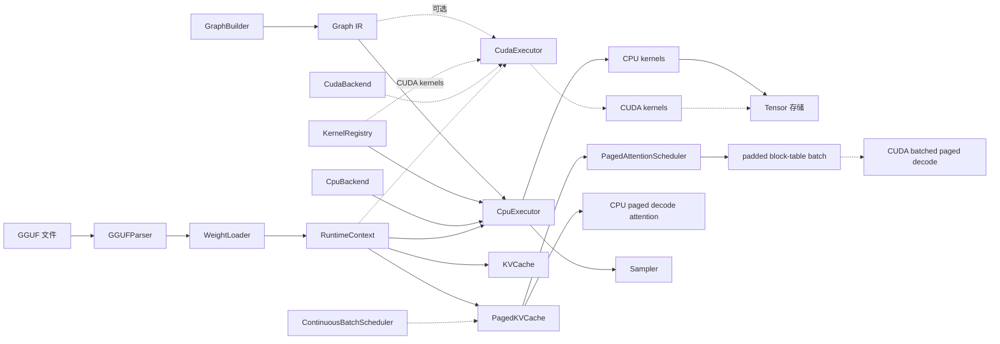

# MiniLLMEngine

MiniLLMEngine 是一个简洁的 C++23 CPU 优先的 LLM 推理项目，追求代码清晰度。它实现了本地推理运行时的核心组件：张量元数据、图 IR、形状推断、CPU 算子分发、可选 CUDA 算子分发、GGUF 解析、权重加载、采样以及基于 KV cache 的生成。

目标不是复刻 llama.cpp，而是在一个较小的代码库里展示推理引擎背后的工程思想 —— 易读、易测、易讲解、易扩展，适合实习面试和作品集展示。

## 亮点

- **C++23 推理运行时**：强类型图 ID、`std::expected` 错误处理、精简的公共伞形头文件。
- **图 IR + 执行器**：`Value`、`Node`、`GraphBuilder`、拓扑排序、后端能力检查、运行时张量绑定。
- **CPU 后端**：FP32 算子，包括 `Linear`、`MatMul`、`RMSNorm`、`QKNorm`、`RoPE`、`Attention`、`Softmax`、`SwiGLU`、`Embedding`、`Transpose` 和 `Reshape`。
- **FlashAttention 风格 CPU 注意力**：分块 K/V 遍历、online softmax，附带与朴素 SDPA 的对比 benchmark。
- **可选 CUDA 后端**：通过 `MINILLM_ENABLE_CUDA` 启用，FP32 算子覆盖同一套核心 Transformer 操作，使用独立的 `CudaExecutor` 路径。
- **KV cache 流程**：单 batch 的 prefill/decode，执行器驱动 cache 长度推进。
- **分页 KV cache**：vLLM 风格的块表、空闲块复用、CPU decode 注意力、多序列调度器、CUDA 设备内存 + 设备块表上的 paged decode。
- **连续批处理调度器**：waiting→prefilling→decoding→finished 生命周期、自动分配序列 ID、KV 块回收/复用。
- **图内存规划器**：活性分析、O(n log n) 最佳匹配缓冲区复用、连续 CPU/CUDA arena 池、峰值内存报告。
- **GGUF 支持**：带边界检查的元数据解析、mmap 支持的张量字节视图、F32/F16/BF16/Q8_0 权重加载、prefill/decode 共享权重存储、embedding 绑定别名、常见 Llama/Qwen 权重名映射。
- **BPE tokenizer**（从 Genllm 移植）：GPT-2 字节到 Unicode 映射、完整正则预分词语状态机、added token 最长匹配、`<0xHH>` 字节 token 解码。
- **测试与基准**：CTest、算子参考测试、执行器集成测试、CPU GEMM/FlashAttention benchmark。
- **代码质量**：`TRY`/`TRY_TENSOR` 宏消除了约 50 处样板错误传播 if 语句；`concepts` 和 `constexpr` 替代运行时 helper；`std::unreachable()` 用于穷举 switch；`kernel_adapter_common.h` 去重了约 95 行共享 adapter helper。

## 架构



## 已实现功能

| 模块 | 状态 |
|------|------|
| Tensor / Shape / DType / Device | 已实现 |
| Graph IR / GraphBuilder / shape inference | 已实现 |
| CPU 执行器和算子注册表 | 已实现 |
| FP32 CPU 算子 | 核心 Transformer 操作已实现 |
| CPU FlashAttention 风格 SDPA | prefill 和 decode 参考路径已实现 |
| 可选 CUDA 执行器/后端 | 实验性，默认关闭 |
| FP32 CUDA 算子 | 已实现，含 CUDA 正确性测试 |
| 图内存规划器 | CPU 和 CUDA 中间张量已实现，O(n log n) 匹配，连续 arena 绑定 |
| GGUF 元数据和张量加载 | F32/F16/BF16 已实现，含解析器安全检查、共享权重存储 |
| 字节级 BPE tokenizer | 已实现（从 Genllm 移植），含 GPT-2 预分词、归并 BPE、`<0xHH>` 字节 token 支持 |
| KV cache prefill/decode | 单 batch 生成已实现 |
| 分页 KV cache / PagedAttention | CPU：已实现。CUDA：设备内存、块表上传、单序列与批量 paged decode、连续 cache prefill/decode —— 全部通过 adapter 衔接。 |
| 连续批处理调度器 | 生命周期核心已实现；实际推理循环集成进行中 |
| CPU benchmark 框架 | 已实现 |

## 快速开始

环境要求：

- CMake 3.22+
- C++23 编译器，如 GCC 13+、Clang 17+ 或 MSVC 19.35+

构建：

```bash
cmake -B build -DCMAKE_BUILD_TYPE=Debug
cmake --build build -j
```

可选 CUDA 构建：

```bash
cmake -B build-cuda -DCMAKE_BUILD_TYPE=Release -DMINILLM_ENABLE_CUDA=ON
cmake --build build-cuda -j
```

CUDA 默认关闭。纯 CPU 构建不需要 CUDA 工具包或 GPU。CUDA 构建默认目标 `sm_86`，适用于 RTX 30 系列等 Ampere GPU；可通过 `-DCMAKE_CUDA_ARCHITECTURES=...` 指定其他 GPU。

运行所有测试：

```bash
ctest --test-dir build --output-on-failure
```

运行示例：

```bash
./build/generate /path/to/model.gguf "Hello"
./build/generate_paged /path/to/model.gguf 32
./build/benchmark_cpu 1 512 512 5
./build/benchmark_flash_attention 2 8
./build-cuda/benchmark_cuda
./build-cuda/generate_cuda /path/to/model.gguf "Hello" 2
```

## llama.cpp 对齐检查

用相同 Qwen3 prompt 对比 MiniLLMEngine 与 `llama.cpp` 的输出，使用对齐辅助脚本：

```bash
python3 scripts/compare_llama_completion.py /path/to/Qwen3-0.6B-BF16.gguf "Hello" 32
```

该脚本使用纯 chat prompt（带空的 `<think></think>` 块）以及与 `generate` 中相同的确定性贪心解码设置，使 prompt 形态和采样行为与 `llama-completion` 保持一致，便于端到端验证。

## CUDA 状态

CUDA 支持是一个可选的实验性模块，其算子结构受 `mini_op` 启发，但通过 MiniLLMEngine 自身的图运行时集成：

- `CudaBackend` 声明后端能力。
- `CudaExecutor` 镜像 CPU 执行器，按 `(DeviceType::CUDA, OpType)` 分派算子。
- `register_cuda_kernels()` 将图节点桥接到 `.cu` 启动包装函数。
- `Tensor::allocate_cuda()` 持有 CUDA 设备内存，同时保持相同的运行时 `Tensor` API。
- `WeightLoader` 可通过 CPU 内存暂存 F32/F16/BF16 GGUF 权重，再拷贝到 CUDA 张量。
- `SharedWeightStore` 每个 GGUF 张量只加载一次，将同一组权重张量绑定到 prefill 和 decode 上下文。
- `KVCache::init_cuda()` 将连续 decode K/V cache 存储到设备上，使 CUDA Attention 可以运行 prefill/decode。

已实现的 CUDA 算子目前针对 FP32 推理：`Embedding`、`Linear`、`MatMul`、`RMSNorm`、`QKNorm`、`Add`、`Mul`、`SiLU`、`SwiGLU`、`RoPE`、无 cache `Attention`、单序列和批量 PagedAttention 风格 decode、`Softmax`、`Reshape` 和 `Transpose`。

`test_cuda_kernels` 将原始 CUDA 核函数与 CPU 参考实现做数值校验，同时也检查带有 `Linear` + bias 的小型 `CudaExecutor` 图。

`generate_cuda` 是 GGUF 模型的当前 GPU 冒烟路径。它在 `Device::cuda(0)` 上构建 Transformer 图、将 GGUF 权重加载到 CUDA 张量、运行 prompt prefill、每次图运行后推进共享 cache，然后在 GPU 上逐 token 解码，同时在 CPU 上对拷贝回的 logits 做采样。

为减小代码库面，旧的纯前向 demo 二进制已删除。`test_cuda_kernels` 覆盖低层 CUDA 算子层面，`generate_cuda` 覆盖端到端 GPU 生成路径。

CUDA 路径目前尚未包含量化 CUDA 矩阵乘法和生产级调度策略。

## 分页 KV Cache

`PagedKVCache` 是 PagedAttention 背后核心思路的精简实现：

- K/V 内存划分为固定大小的 token 块（CPU 用 `std::vector`，CUDA 用 `cudaMalloc`）。
- 每个序列持有一个块表，将逻辑 token 位置映射到物理块。
- 释放的序列将块归还可复用的空闲链表。
- `init_cuda()` 分配设备端块池；`write_tokens_cuda()` 做设备到设备的 K/V 拷贝；`upload_block_table()` 将块表上传至设备内存。
- `PagedAttentionScheduler` 维护小型活跃序列集，输出 padded 批量元数据：序列 ID、序列长度、展平块表。
- `paged_attention_decode()` 通过块表读取 K/V，支持 GQA（CPU 参考实现）。
- `cuda::paged_attention_decode()` 在设备端 K/V 页和设备块表上运行相同的 decode 模式。
- `cuda::paged_attention_decode_batch()` 消费调度器风格的批量元数据，在一次启动中解码多个活跃序列。

调度器刻意保持精简：它不是一个生产级请求队列，而是展示了分页 KV 分配与批量 GPU decode 之间的核心桥梁。

## 连续批处理调度器

`ContinuousBatchScheduler` 管理请求的四个生命周期阶段：

1. **Waiting**：请求已提交但尚未分配 KV 块
2. **Prefilling**：KV 块已分配，prompt token 处理中
3. **Decoding**：自回归 token 生成，每步一个 token
4. **Finished**：遇到 EOS 或达到最大 token 数；块归还空闲链表

调用方驱动实际模型计算。调度器提供：

- `submit()`：添加带 prompt token 和最大输出长度的请求
- `admit_waiting()`：将等待请求移入活跃集（分配 KV 块）
- `active_ids()`：当前有哪些序列在生成
- `evict_finished()`：释放已完成序列的块
- `collect_finished()`：获取完成的输出
- `state()`：检查每个序列的阶段、已生成 token 数等

这种解耦意味着调度器可与任意执行器（CPU、CUDA 或 mock）和任意采样策略结合使用。当前代码直接测试调度器生命周期；将其接入实际生成循环是下一步的实现目标。

```cpp
ContinuousBatchScheduler scheduler(cache, {.max_batch_size = 4});
scheduler.submit({.prompt_tokens = {1, 2, 3}, .max_tokens = 64});
scheduler.admit_waiting();
// ... 运行 decode 步骤，调用 mark_token_generated()、mark_finished()、evict_finished() ...
```

## CPU 基准测试

`benchmark_cpu` 测量 CPU 后端的 GEMM 路径。

```bash
./build/benchmark_cpu [M] [N] [K] [iters]
```

`sgemm_nt` 对应最常见的 Transformer Linear 布局：

```text
A[M,K] x W[N,K]^T -> C[M,N]
```

开发服务器（24 核，AVX-512）Release 模式运行：

```text
./build/benchmark_cpu 1 2048 2048 50
sgemm_nt     shape=[1,2048,2048] iters=50 avg_ms=0.9308 gflops=9.01  (1 thread)
sgemm_nt     shape=[1,2048,2048] iters=50 avg_ms=1.1641 gflops=7.21  (24 threads)
sgemm        shape=[1,2048,2048] iters=50 avg_ms=2.5710 gflops=3.26  (1 thread)
sgemm        shape=[1,2048,2048] iters=50 avg_ms=0.8781 gflops=9.55  (24 threads)
```

| M (batch) | sgemm_nt (1 线程) | sgemm_nt (24 线程) | 加速比 |
|-----------|-------------------|---------------------|---------|
| 1 | 9.0 GFLOPS | 7.2 GFLOPS | 0.8x |
| 4 | 11.1 GFLOPS | 18.5 GFLOPS | 1.7x |
| 128 | 9.1 GFLOPS | 68.9 GFLOPS | 7.6x |

`sgemm_nt` 随 batch 大小良好扩展。M=1 解码时并行度有限，但 M≥4（小 batch prefill）时 24 线程加速已经可见。M=128（大 batch prefill）时达到约 69 GFLOPS。

`benchmark_flash_attention` 对比朴素 CPU SDPA 与分块 online softmax FlashAttention 风格 CPU 路径：

```bash
./build/benchmark_flash_attention [iters] [heads]
```

```text
    seq head_dim  heads      sdpa_ms     flash_ms   speedup max_rel_err
    128       64      8       21.480        5.424      3.96    1.41e-04
    128      128      8       42.348        9.474      4.47    3.17e-03
    256       64      8       85.924       20.892      4.11    5.39e-04
    256      128      8      167.298       36.709      4.56    3.17e-03
    512       64      8      342.438       81.952      4.18    1.72e-03
    512      128      8      667.909      144.190      4.63    3.17e-03
```

FlashAttention 在所有测试的序列长度上相比朴素 SDPA 有约 4x 加速。

## CUDA 基准测试

CUDA 基准测试在 RTX 3080 16GB（Ampere SM86）上测量，FP32，Release 构建。

```bash
./build-cuda/benchmark_cuda
```

### Transformer 算子

| 算子 | 形状 | 耗时 | 备注 |
|----|-------|------|-------|
| `sgemm_nt` | [4, 4096] × [4096, 4096] | 0.54 ms | 247 GFLOPS（prefill batch=4） |
| `sgemm_nt`（decode） | [1, 4096] × [4096, 4096] | 0.29 ms | 115 GFLOPS（单 token） |
| `rmsnorm` | [4096, 1024] | 78 µs | — |
| `add` / `mul` | 16M 元素 | ~420 µs | 逐元素 |
| `silu` | 16M 元素 | 281 µs | — |
| `fused_silu_mul` | 16M 元素 | 417 µs | 融合 SwiGLU |
| `embedding` | seq=256, vocab=151936 | ~2 µs | 从 151936×1024 表 gather |
| `apply_rope` | 256 tokens, 16 heads | ~0.3 µs | 原地旋转位置编码 |
| `softmax` | [4096, 151936] | ~2 ms | 全词汇表逐行 |
| `sdpa` | seq=256, 16 heads, dim=128 | 1.77 ms | 因果注意力，含 GQA |
| `kv_cache_attn` | KV=128 tokens, 16 heads | ~15 µs | 连续 cache decode |
| `paged_attn_decode` | KV=128 tokens, 16 heads | ~15 µs | 分页 cache decode（block_size=16） |
| `transpose` | [64, 128] | ~0.2 µs | — |

## CPU vs CUDA 对比

| 算子 | CPU（24 线程） | CUDA（RTX 3080） | 倍率 |
|----|-------------------|------------------|-------|
| GEMM M=4（prefill） | 18.5 GFLOPS | 247 GFLOPS | 13× |
| GEMM M=1（decode） | 7.2 GFLOPS | 115 GFLOPS | 16× |
| Flash/SDPA（seq=256） | 36.7 ms | 1.77 ms | 21× |

## 测试

CTest 当前运行：

```bash
./build/test_shape
./build/test_tensor
./build/test_graph
./build/test_graph_builder
./build/test_runtime
./build/test_cpu_kernels
./build/test_memory_planner
./build/test_paged_kv_cache
./build/test_paged_attention_scheduler
./build/test_continuous_batch_scheduler
./build/test_gguf_parser
./build/test_transformer_graph_builder
./build/test_bpe_tokenizer
./build/test_e2e_verification
```

测试套件覆盖：

- 形状和张量分配行为
- 图的构建与验证
- CPU 执行器集成
- CPU 算子数值参考校验，含 FlashAttention 风格 SDPA 对比
- 图活性分析、内存复用规划、CPU/CUDA arena 绑定
- Transformer 图权重命名及 RoPE 元数据传播
- tokenizer 边界行为及 GGUF 解析器安全检查
- KV cache prefill/decode 推进
- 分页 KV 块分配、调度器批量元数据及 paged decode attention
- 连续批处理调度器：准入、逐出、阶段转换、块复用
- 连续与分页 KV cache 数值对齐（余弦相似度、最大绝对差）
- CUDA 逐元素、GEMM、归一化、RoPE、softmax、转置、SDPA、单序列/批量 paged decode 及执行器调度
- GGUF 解析器和权重转换辅助
- 通过 `generate_cuda` 的 CUDA 单 batch GGUF 生成冒烟路径

## 项目结构

```text
include/minillm/
  core/        Tensor, Shape, DType, Device, Status
  graph/       Graph IR, Node, Value, 属性, 形状推断
  runtime/     Backend, executor, CPU/CUDA kernels, KV cache, paged KV cache, sampler, scheduler, kernel adapter 公共 helper
  io/          GGUF 解析器, 权重加载器, tokenizer
  model/       Transformer 图构建器

src/
  core/        核心运行时数据结构
  graph/       图实现和构建逻辑
  runtime/     CPU 后端, 可选 CUDA 后端, 执行路径
  io/          GGUF 和 tokenizer 实现
  model/       Decoder-only 图构建

examples/      CLI demo、生成和基准测试
tests/         单元、集成和端到端验证测试
docs/          设计笔记
```

## 设计笔记

更深入的架构说明见 [docs/design.md](docs/design.md)，运行时流程图见 [docs/runtime_flows.md](docs/runtime_flows.md)。

关键设计选择：

- `Value` 是逻辑张量描述符。`Tensor` 持有或引用运行时存储。
- `GraphBuilder` 在构建节点时执行形状推断。
- `CpuExecutor` 验证后端支持、通过 `KernelRegistry` 解析算子、按拓扑顺序运行节点。
- `CudaExecutor` 在项目以 `MINILLM_ENABLE_CUDA=ON` 构建时镜像 CPU 执行器。
- `RuntimeContext` 将 `ValueId` 绑定到运行时 `Tensor` 对象，并持有中间张量。
- `KVCache` 在 prefill 和 decode 上下文之间共享，一次成功的图运行后推进一次。
- `SharedWeightStore` 使 prefill 和 decode 上下文复用一个已加载的 GGUF 权重集，无需复制模型参数。
- `PagedKVCache` 将逻辑序列位置与物理 KV 块分离；`PagedAttentionScheduler` 将多个活跃序列转为 padded 块表 batch。
- `MemoryPlanner` 计算中间张量活性区间；`RuntimeContext::allocate_intermediates_planned()` 将非重叠的 CPU/CUDA 中间张量绑定到共享 arena 缓冲区。
- CUDA 目前覆盖 FP32 算子分派、张量分配、GGUF 权重暂存到设备张量、连续 CUDA KV cache 生成、paged decode 核函数（完整 adapter 集成），以及图内存 arena 分配（CPU 和 CUDA）。生产级批处理策略和量化 CUDA 矩阵乘法被有意留作未来工作。

## 参考资料

本项目是一个独立的学习实现，受以下项目启发：

- [llama.cpp / ggml](https://github.com/ggml-org/llama.cpp)
- [Genllm](https://github.com/Aimol-l/Genllm)
- [mini_op](https://github.com/plutoaac/mini_op)

## 路线图

对作品集价值较高的近期工作：

- ~~运行并记录端到端 Qwen3-0.6B CPU 和 CUDA 生成冒烟 demo，含参考对齐。~~ 已完成。
- ~~添加 Release 模式 prefill/decode 延迟和 GEMM 吞吐量的 benchmark 表格。~~ 已完成。
- ~~添加已测试 FP32 算子的 Release 模式 CUDA benchmark 数据。~~ 已完成。
- 实现首个量化权重路径，大概率是 `Q8_0`。
- 将 `ContinuousBatchScheduler` 接入真实 decode 循环。

长期探索：

- 更优化的 GEMM 微核函数和权重打包。
- 多线程 CPU 执行。
- 前缀 cache、生产级连续批处理、多序列调度。
- 最小化流式 HTTP API。
