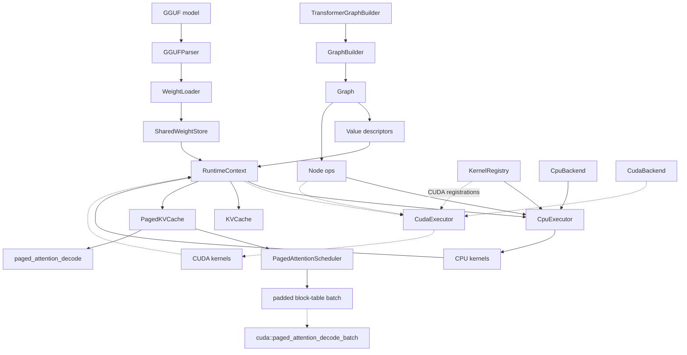
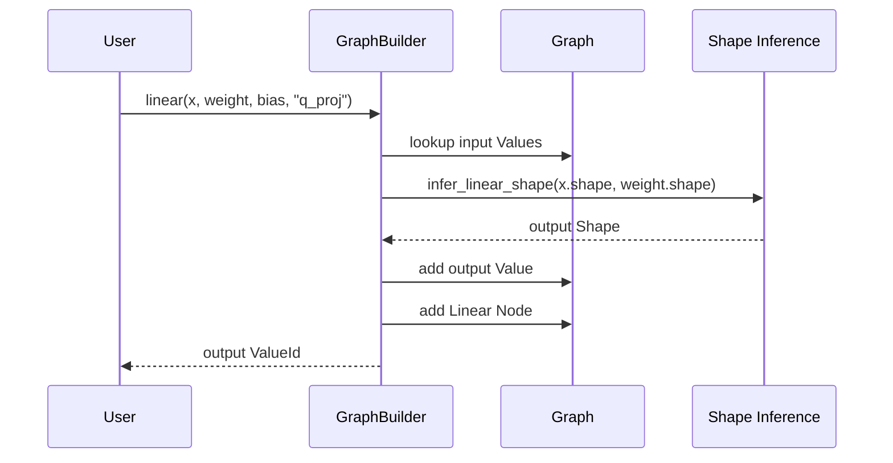
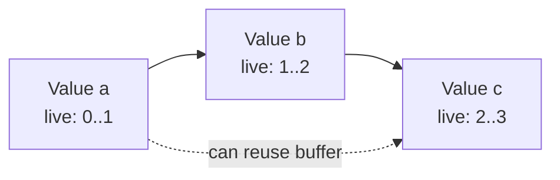
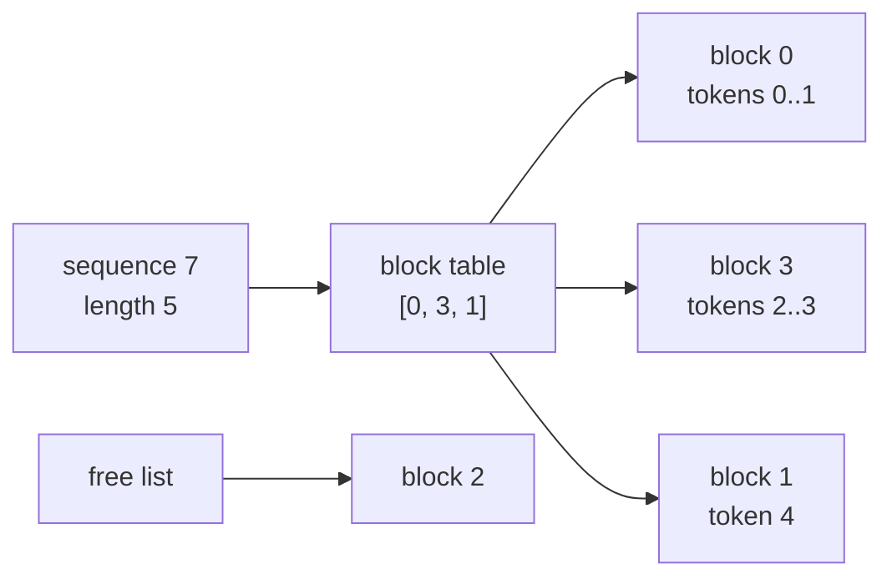

# MiniLLMEngine Design

MiniLLMEngine is a compact CPU-first LLM inference runtime. It borrows ideas from systems such as llama.cpp and ggml, but keeps the implementation intentionally small so each subsystem can be understood and tested independently.

The design goal is to demonstrate the core engineering concepts behind local LLM inference:

- graph construction and shape inference
- runtime tensor binding and memory ownership
- backend capability checks and kernel dispatch
- CPU transformer kernels
- optional CUDA transformer kernels
- GGUF model loading
- shared model weights across generation contexts
- KV cache based prefill/decode generation
- block-table based paged KV cache design
- small multi-sequence scheduling over paged KV blocks

## System Overview



The runtime is separated into five layers:

| Layer | Responsibility |
|-------|----------------|
| Core | `Shape`, `DType`, `Device`, `Status`, and physical `Tensor` storage |
| Graph | Logical `Value` and `Node` descriptors plus graph validation and topological sort |
| Model | Transformer graph construction using `GraphBuilder` |
| Runtime | `RuntimeContext`, `CpuExecutor`, optional `CudaExecutor`, backend capability checks, kernel registries, KV cache, paged KV cache, paged attention scheduler, sampler |
| IO | GGUF metadata parsing, tensor loading, weight-name mapping, and tokenizer |

## Core Types

### Shape

`Shape` stores tensor dimensions and uses `-1` for dynamic dimensions. Static allocation requires all dimensions to be known.

Important behavior:

- `numel()` rejects dynamic shapes.
- shape inference can propagate dynamic dimensions.
- runtime allocation happens only after graph shapes are concrete.

### Tensor

`Tensor` is the physical runtime container. It owns a CPU byte buffer by default and can own CUDA device memory when the project is built with `MINILLM_ENABLE_CUDA=ON`. It carries:

- name
- shape
- dtype
- device
- storage

The graph never stores tensor data. It only stores logical `Value` descriptors. Runtime data is attached later through `RuntimeContext`.

The CUDA storage path is deliberately explicit: `allocate_cpu()` and `allocate_cuda()` select the memory owner, and `data()` returns the pointer for the active storage. This keeps the CPU code path simple while allowing a CUDA executor to reuse the same `Tensor` abstraction.

### Status

The project uses `Status` and `std::expected<T, Status>` instead of exceptions for normal error paths. This keeps graph construction, parsing, loading, and execution errors explicit.

## Graph IR

The graph IR is intentionally simple:

- `Value` describes a logical tensor.
- `Node` describes an operation with input and output `ValueId`s.
- `Graph` owns all values and nodes.
- `GraphBuilder` provides a typed construction API with shape inference.

Strong ID wrappers such as `ValueId` and `NodeId` avoid accidentally mixing raw integers with graph identifiers.

### Node Example

A `Linear` node is represented as:

```text
inputs:  [x, weight, optional_bias]
outputs: [y]
attrs:   none
op:      Linear
```

The output `Value` is created at build time after `infer_linear_shape()` validates the input and weight shapes.

## Graph Construction Flow



This makes graph construction fail early when shapes are incompatible. For example, `Linear` validates the input feature dimension and optional bias shape before adding the node.

## Execution Model

Execution is split into compile and run.

### Compile

`CpuExecutor::compile()`:

1. validates the graph
2. topologically sorts nodes
3. asks `CpuBackend` whether each op is supported
4. checks that a CPU kernel exists in `KernelRegistry`
5. stores the execution order

`CudaExecutor::compile()` follows the same contract but checks `DeviceType::CUDA` kernel registrations. It is compiled only when CUDA support is enabled.

### Run

`CpuExecutor::run()`:

1. walks nodes in topological order
2. skips graph-only nodes such as `Input`, `Constant`, and `Output`
3. resolves the kernel function by `(DeviceType, OpType)`
4. runs the kernel with the current `RuntimeContext`
5. advances the shared KV cache once if the context requested it

The executor does not own tensor memory. It only reads bindings from `RuntimeContext`.

`CudaExecutor::run()` mirrors this flow and launches CUDA kernels through the same registry abstraction. The low-level CUDA wrappers return launch errors without forcing a device-wide synchronize, so callers can decide when they want hard synchronization for tests or profiling.

## RuntimeContext

`RuntimeContext` maps graph `ValueId`s to runtime `Tensor*`.

It supports two ownership modes:

- `bind(ValueId, Tensor*)` for externally owned tensors
- `emplace(ValueId, unique_ptr<Tensor>)` for context-owned tensors

This split is important for generation. Prefill and decode are built as two graphs with different sequence lengths, but they reference the same model parameters. `SharedWeightStore` loads each GGUF tensor once, records aliases from graph value names to the stored tensor, and then binds those external tensors into both contexts. For tied embeddings, `lm_head.weight` can alias `tok_embeddings.weight` when the GGUF file does not carry a separate output tensor.

It also owns optional runtime state:

- shared `KVCache`
- `kv_cache_advance_tokens`

The cache advance value is set by the caller:

```cpp
prefill_ctx.set_kv_cache_advance_tokens(prompt_len);
decode_ctx.set_kv_cache_advance_tokens(1);
```

After a successful graph run, `CpuExecutor` calls `advance_kv_cache_step()` exactly once. This avoids advancing once per attention layer.

Intermediate allocation is device-aware: a graph value tagged with `Device::cuda(index)` allocates CUDA storage, while the default CPU graph allocates CPU storage. The plain `allocate_intermediates()` path still gives each value its own tensor. The planned path, `allocate_intermediates_planned()`, runs `MemoryPlanner`, allocates CPU arena buffers, and binds eligible intermediate tensors as non-owning views into those arenas. Outputs and other skipped values fall back to normal allocation.

## Graph Memory Planner

`MemoryPlanner` analyzes a graph without changing execution behavior. It answers a systems question that matters in inference runtimes: which intermediate tensors can share the same memory because their lifetimes do not overlap?

The planner currently targets CPU contiguous tensors and intentionally excludes:

- inputs
- constants and weights
- outputs by default
- dynamic-shape values
- non-CPU values
- KV cache storage

This keeps the first implementation predictable and easy to explain.

### Liveness Model

Each graph value gets a live range:

```text
first_node = node that produces the value
last_node  = last node that consumes the value
```

Inputs and constants are tracked for reporting but are not eligible for reuse. Output values are kept out of the reusable pool by default because callers usually need them after graph execution.



In this example `a` and `c` can share a buffer because `a.last_node < c.first_node`.

### Buffer Assignment

The planner uses a conservative best-fit policy:

1. sort eligible ranges by first use
2. keep live buffers ordered by `last_use`
3. move newly-free buffers into per-pool free sets keyed by dtype and device
4. use `lower_bound` to find the smallest buffer large enough for the current range
5. otherwise allocate a new logical buffer

This keeps matching at O(n log n) instead of scanning all previous buffers for every range.

The output is a `MemoryPlan` containing:

- one `MemoryLiveRange` per graph value
- reusable `MemoryBuffer` assignments
- naive aligned bytes
- planned peak bytes
- reuse saving ratio

Example report:

```text
Graph memory plan:
  values: 42
  eligible intermediates: 28
  skipped values: 14
  buffers: 11
  alignment: 64
  naive bytes: 50331648 (48.00 MiB)
  planned peak: 20971520 (20.00 MiB)
  reuse saving: 58.3%
```

`RuntimeContext::allocate_intermediates_planned()` consumes this plan. Buffers with the same dtype and device are placed into one contiguous arena, then normal `Tensor` objects point at `arena_base + buffer.offset`. Values with non-overlapping live ranges can therefore have different shapes but the same backing pointer. Constants and model weights are still externally bound, and outputs are kept separately by default so callers can safely read them after execution.

## CPU Backend

The CPU backend has two parts:

- `CpuBackend` declares supported ops.
- `KernelRegistry` maps ops to implementation functions.

The adapter layer in `cpu_kernel_adapter.cpp` converts graph-level tensors into raw pointers and shapes, checks dtype/allocation constraints, then calls the lower-level kernels in `cpu_kernels.cpp`.

Implemented CPU ops include:

- `Embedding`
- `MatMul`
- `Linear` with optional bias
- `RMSNorm`
- `QKNorm`
- `Add`
- `Mul`
- `SiLU`
- `SwiGLU`
- `RoPE`
- `Attention`
- `Softmax`
- `Reshape`
- `Transpose`

The CPU attention path now has two implementations. `sdpa()` is the straightforward reference-style implementation that materializes a score row, applies softmax, and then multiplies by V. `flash_sdpa()` and `flash_sdpa_decode()` use tiled K/V traversal with online softmax state:

```text
m = running max
l = running exp-sum
o = running weighted V accumulator
```

Each K/V tile updates `(m, l, o)` without materializing the full attention matrix. This is FlashAttention-style in memory behavior and is still intentionally small enough to read in one file. The `benchmark_flash_attention` executable compares this path against `sdpa()` for prefill-shaped causal attention.

## Optional CUDA Backend

The CUDA backend follows the same three-layer shape as the CPU runtime:

| Layer | File | Purpose |
|-------|------|---------|
| Capability | `cuda_backend.cpp` | Declares which graph ops CUDA can execute |
| Adapter | `cuda_kernel_adapter.cpp` | Checks graph tensors, dtypes, devices, and shapes |
| Kernels | `cuda_kernels.cu` | Launches raw CUDA kernels |

This mirrors the CPU split, so adding a new CUDA op means adding the low-level kernel, then registering the graph-level adapter in `register_cuda_kernels()`.

Current CUDA scope:

- FP32 `Embedding`, `Linear`, `MatMul`, `RMSNorm`, `QKNorm`
- FP32 `Add`, `Mul`, `SiLU`, `SwiGLU`
- FP32 `RoPE`, no-cache `Attention`, `Softmax`
- FP32 single-sequence and batched PagedAttention decode over device block tables
- FP32 `Transpose`
- dtype-preserving CUDA `Reshape` through device-to-device copy
- GGUF F32/F16/BF16 weight staging into CUDA tensors for no-cache forward smoke tests
- single-batch CUDA generation with a contiguous device KV cache

The kernels are intentionally straightforward. `sgemm` uses a tiled shared-memory path, `sgemm_nt` matches transformer weights stored as `[out_features, in_features]`, RMSNorm and Softmax use block reductions, RoPE computes sin/cos on the fly, and attention kernels support GQA by mapping query heads to KV heads. CUDA SDPA and decode attention use an online-softmax fused shape, but the CUDA path does not yet implement a full shared-memory tiled FlashAttention kernel.

The CUDA path is experimental and disabled by default:

```bash
cmake -B build-cuda -DCMAKE_BUILD_TYPE=Release -DMINILLM_ENABLE_CUDA=ON
cmake --build build-cuda -j
```

By default the CUDA build targets `sm_86`, which matches the RTX 30-series GPU used for validation. Other machines can override this with `-DCMAKE_CUDA_ARCHITECTURES=...`.

The `test_cuda_kernels` executable validates:

- elementwise ops and fused SwiGLU
- `sgemm`, `sgemm_nt`, and Linear bias add
- RMSNorm, Embedding, RoPE, Softmax, and Transpose
- no-cache SDPA with GQA
- paged decode attention with non-contiguous single-sequence and batched block tables
- `CudaExecutor` dispatch on a small graph

What is not implemented yet:

- CUDA paged-cache integration in the full generation loop
- production serving integration around the toy paged attention scheduler
- CUDA quantized matmul
- CUDA arena allocation driven by `MemoryPlanner`
- CUDA performance benchmarks

The `forward_tiny_llama_gguf_cuda` example is a forward-only smoke test. It builds the graph on `Device::cuda(0)`, allocates CUDA tensors, lets `WeightLoader` copy weights to device memory, and copies logits back to the host for validation.

The `generate_cuda` example uses the same graph/runtime shape but attaches a CUDA `KVCache`. During prefill, CUDA Attention copies K/V rows into device cache storage and runs no-cache SDPA over the prompt. During decode, it writes the new token's K/V row at `cached_len` and calls a decode kernel over `[cached_len + 1]` contiguous KV rows. The executor still advances cache length once after the full graph run, matching the CPU path.

## GEMM Design

Transformer inference spends much of its CPU time in linear projections.

The common layout used by the project is:

```text
x:      [M, K]
weight: [N, K]
out:    [M, N]
```

This is computed as:

```text
out = x @ weight^T
```

The dedicated `sgemm_nt()` path is optimized for this layout and unrolls four output columns at a time. This avoids repeatedly scanning the same `A` row for adjacent output channels.

The benchmark executable measures this path:

```bash
./build/benchmark_cpu 1 2048 2048 20
```

FlashAttention-style CPU attention can be benchmarked with:

```bash
./build/benchmark_flash_attention 2 8
```

## Attention And KV Cache

The attention kernel supports two runtime modes.

### No Cache

Without a cache, Q/K/V are reinterleaved into:

```text
Q: [heads, q_len, head_dim]
K: [heads, kv_len, head_dim]
V: [heads, kv_len, head_dim]
```

Then scaled dot-product attention is computed directly. On CPU, the executor uses the FlashAttention-style `flash_sdpa()` implementation for this no-cache path; the naive `sdpa()` remains available for tests and benchmarking.

### Cache Path

With a cache, the runtime uses separate prefill and decode behavior.

Prefill:

1. K/V for the full prompt are copied into `KVCache`.
2. attention is computed over the prompt with the FlashAttention-style CPU path or CUDA online-softmax SDPA.
3. after the graph completes, the executor advances the cache by `prompt_len`.

Decode:

1. seq_len must be 1.
2. the new K/V row is appended at `cached_len`.
3. attention is computed over the full cached prefix plus the new token.
4. after the graph completes, the executor advances the cache by 1.

This keeps cache length updates outside individual attention nodes and prevents double-advancing when a graph has multiple transformer layers.

## Paged KV Cache And PagedAttention

The contiguous `KVCache` is simple and works well for single-batch generation. It stores each layer as one dense `[max_seq_len, num_kv_heads * head_dim]` region. That layout is easy to reason about, but it assumes each request owns one contiguous cache range.

`PagedKVCache` adds the core data structure used by PagedAttention-style runtimes:

```text
logical token position -> logical block index -> physical block id
```

Each sequence owns a block table. Blocks are fixed-size token pages, such as 16 or 32 tokens in a production system. Freeing a sequence returns its physical blocks to a free list, so future sequences can reuse them without compacting a large contiguous KV buffer.



The first implementation is a CPU reference path:

- `PagedKVCache::write_tokens()` writes K/V rows into block-table storage.
- `PagedKVCache::free_sequence()` returns blocks to the allocator.
- `paged_attention_decode()` reads K/V through the block table.
- GQA is supported by mapping query heads to KV heads.

The decode attention API expects:

```text
q:      [num_heads, head_dim]
output: [num_heads, head_dim]
cache:  paged K/V rows for one sequence and layer
```

### Multi-Sequence Scheduler

`PagedAttentionScheduler` is the small scheduling layer that sits above `PagedKVCache`. It keeps an ordered active set of sequence IDs, validates that each sequence has live KV pages, and builds a compact batch descriptor:

```text
sequence_ids:              [seq0, seq1, ...]
sequence_lengths:          [len0, len1, ...]
block_tables flattened:    [batch_size, max_blocks_per_sequence]
```

Shorter sequences are padded with `-1` in the flattened block table. The decode kernel only reads blocks covered by each sequence length, so the padding is metadata only. This shape mirrors the handoff used in PagedAttention-style serving systems: the scheduler owns request membership and block-table metadata, while the attention kernel owns the hot K/V reads.

The CPU scheduler path can decode each active sequence through the reference `paged_attention_decode()`. The CUDA path exposes `cuda::paged_attention_decode_batch()`, which accepts device-resident K/V pages plus the scheduler-style block table and sequence length arrays:

```text
q:                [batch_size, num_heads, head_dim]
k_cache/v_cache:  [max_blocks, block_size, num_kv_heads * head_dim]
block_tables:     [batch_size, max_blocks_per_sequence]
output:           [batch_size, num_heads, head_dim]
```

This is still a toy scheduler, not a server runtime. It does not yet implement admission control, preemption, request queues, prefix reuse, or streaming token handoff. Its purpose is to make the paged KV layout useful for multiple active sequences and to provide a clear stepping stone toward continuous batching.

## Continuous Batching Scheduler

`ContinuousBatchScheduler` manages request lifecycle across four phases:

| Phase | Description |
|-------|-------------|
| Waiting | Request submitted, not yet allocated KV blocks |
| Prefilling | KV blocks allocated, prompt tokens being processed |
| Decoding | Autoregressive token generation, one token per step |
| Finished | EOS or max tokens reached; KV blocks returned to free list |

The scheduler is deliberately decoupled from model execution. The caller drives the actual compute and informs the scheduler of progress:

```cpp
scheduler.submit({.prompt_tokens = {1, 2, 3}, .max_tokens = 64});
scheduler.admit_waiting();  // allocates KV blocks, moves to Prefilling
// Prefill: caller writes prompt K/V into PagedKVCache, then:
scheduler.mark_prefill_progress(seq_id, prompt_len);
// Decode loop: caller runs model, samples token, then:
scheduler.mark_token_generated(seq_id, token);
// When finished:
scheduler.evict_finished();  // frees KV blocks
auto outputs = scheduler.collect_finished();
```

This design means the scheduler works with any executor backend (CPU, CUDA, mock) and any sampling strategy. Block allocation and deallocation are tied to `PagedKVCache::reserve_sequence()` and `PagedKVCache::free_sequence()`, giving direct memory visibility.

The `generate_paged` example currently demonstrates multi-sequence decode using `PagedKVCache` for KV storage. `ContinuousBatchScheduler` is covered by its own lifecycle tests and is the next component to wire into that real generation loop.

## GGUF Loading

The IO layer is split into:

- `GGUFParser`: reads file header, metadata, tensor infos, and raw tensor data.
- `WeightLoader`: maps GGUF tensor names to graph value names and converts supported formats to FP32 runtime tensors.
- `BPETokenizer`: byte-level BPE tokenizer with GPT-2 pre-tokenization initialized from GGUF metadata.

Currently supported weight data types:

- F32
- F16 to F32
- BF16 to F32

When built with `MINILLM_ENABLE_CUDA=ON`, `WeightLoader` can dequantize through a temporary CPU staging buffer and copy the FP32 result into CUDA tensors. This keeps parsing and conversion simple while allowing real GPU forward-pass smoke tests.

For generation, `WeightLoader::load_shared_weights()` returns a `SharedWeightStore` instead of immediately copying into one context. The store owns CPU or CUDA tensors according to the graph device, while each `RuntimeContext` only binds pointers to those tensors:

```text
GGUF tensor "token_embd.weight"
    -> stored once as Tensor
    -> alias "tok_embeddings.weight"
    -> alias "lm_head.weight" when embeddings are tied
    -> bound into prefill_ctx and decode_ctx
```

This removes the largest avoidable memory duplication in the current two-graph generation path. Activations remain separate because prefill and decode have different shapes, while weights and KV cache are shared runtime state.

Quantized GGUF tensors are a future extension.

## Testing Strategy

The project uses small focused tests instead of relying only on end-to-end generation.

| Test | Purpose |
|------|---------|
| `test_shape` | shape and dynamic-dimension behavior |
| `test_tensor` | tensor byte sizing and CPU allocation |
| `test_graph` | graph validation and dumping |
| `test_graph_builder` | shape inference and builder-level validation |
| `test_cpu_kernels` | direct numerical checks for low-level CPU kernels, including FlashAttention-style SDPA |
| `test_runtime` | executor integration, KV cache, embedding, linear bias, graph ops |
| `test_gguf_parser` | GGUF parsing, metadata, tensor reading, F16/BF16 conversion, shared tied-weight binding |
| `test_memory_planner` | graph liveness, buffer reuse planning, planned CPU arena binding, skip reasons, report output |
| `test_paged_kv_cache` | paged block allocation, sequence free/reuse, paged decode attention |
| `test_paged_attention_scheduler` | active sequence batching, padded block tables, CPU multi-sequence decode |
| `test_continuous_batch_scheduler` | admission, eviction, phase transitions, block reuse, finished request collection |
| `test_e2e_verification` | contiguous vs paged KV numerical alignment, multi-sequence paged decode, block reuse |
| `test_transformer_graph_builder` | transformer weight naming and RoPE base propagation |
| `test_bpe_tokenizer` | tokenizer initialization and boundary behavior |
| `test_cuda_kernels` | CUDA kernels, single/batched CUDA paged decode, and CUDA executor dispatch, only built with `MINILLM_ENABLE_CUDA=ON` |

The important split is:

- kernel tests catch numerical bugs in primitive ops
- runtime tests catch graph/context/executor integration bugs
- GGUF tests catch model loading regressions
- tokenizer and model-builder tests protect the GGUF-to-graph integration surface

## Current Limitations

MiniLLMEngine is intentionally CPU-first and small. It does not currently implement:

- quantized kernels such as Q8_0 or Q4_K
- mmap-based weight loading
- CUDA arena allocation for intermediate tensors
- multi-threaded execution
- continuous batching and a production request scheduler
- prefix cache and block sharing across requests
- production-grade tokenizer compatibility
- CUDA quantized kernels
- Metal / Vulkan backends

These are valid future extensions, but they are not required for the project's current purpose.

## Design Tradeoffs

### Why Graph IR?

A graph IR makes it possible to separate model construction from execution. It also makes validation, backend checks, and future memory planning easier.

### Why CPU First?

CPU execution keeps the project portable and makes the core runtime easier to debug. It also creates room to discuss real systems topics such as cache behavior, SIMD, GEMM layout, and memory reuse.

### Why Keep Tensors Separate From Values?

`Value` describes what should exist. `Tensor` stores the data at runtime. This mirrors the separation between graph-level planning and execution-time memory.

### Why Executor-Driven KV Cache Advancement?

KV cache length is a graph-run-level state change, not an attention-node-level state change. Advancing in the executor means a multi-layer transformer can run all attention nodes and update the cache exactly once.

### Why Add Paged KV Cache?

Paged KV cache demonstrates the memory-management idea behind PagedAttention without requiring a full serving stack. The important concept is the block table: logical sequence positions no longer require physically contiguous KV memory. That makes the module useful for discussing fragmentation, multi-request serving, and long-context memory pressure.

## Interview Talking Points

This project is useful to discuss:

- how a model graph is represented and validated
- how shape inference catches errors before execution
- how kernel dispatch works in a backend runtime
- why Linear commonly uses `A[M,K] x W[N,K]^T`
- how online softmax removes the need to materialize the full attention matrix
- how KV cache changes decode complexity
- why PagedAttention uses block tables instead of one large contiguous cache per sequence
- how a scheduler turns multiple paged KV block tables into one batch for decode
- how `ContinuousBatchScheduler` manages request lifecycle from prefill through decode to eviction
- how GGUF metadata and tensor loading fit into inference
- how parser bounds checks prevent malformed model files from turning into unsafe allocations
- how a CPU backend can be mirrored by an optional CUDA backend
- how CUDA paged decode reads K/V through device block tables
- how CUDA generation uses a device-side contiguous KV cache for prefill/decode
- how shared GGUF weights avoid loading parameters once per generation graph
- how GGUF weights can be staged from host parsing into CUDA tensor storage
- how to test numerical kernels separately from runtime integration

Good follow-up improvements:

- add Q8_0 weight loading and matmul
- add Release-mode benchmark tables
- add Release-mode activation-memory and prefill/decode benchmark tables
- add Release-mode CUDA benchmark tables
- connect the toy scheduler to an end-to-end decode loop
- add multi-threaded GEMM
- align an end-to-end Qwen3-0.6B run against llama.cpp for the first few generated tokens
