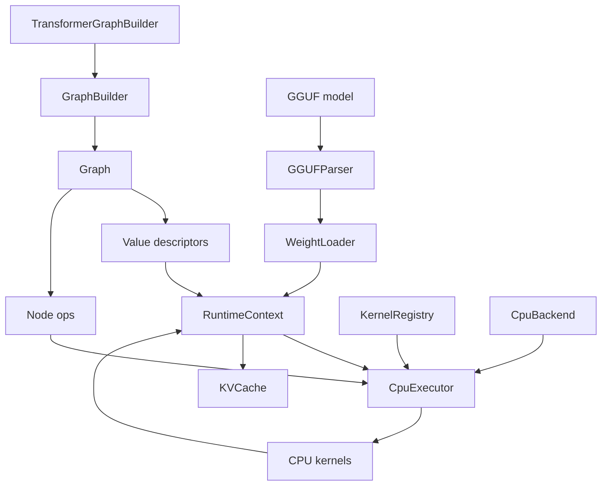
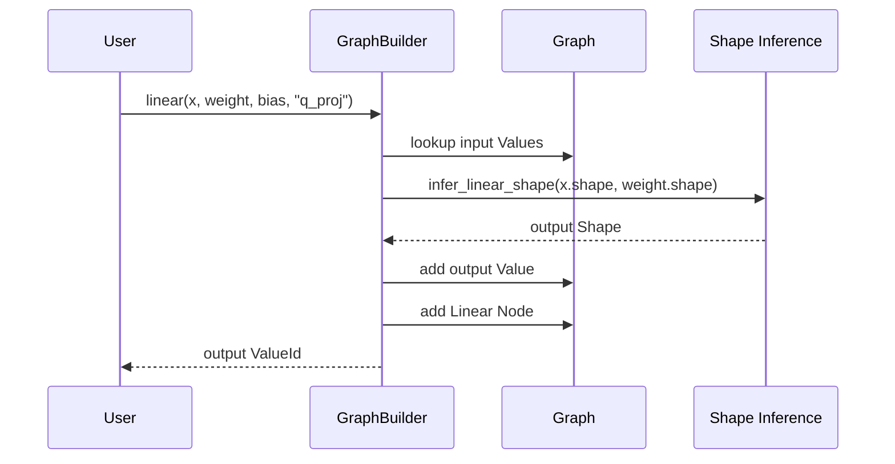
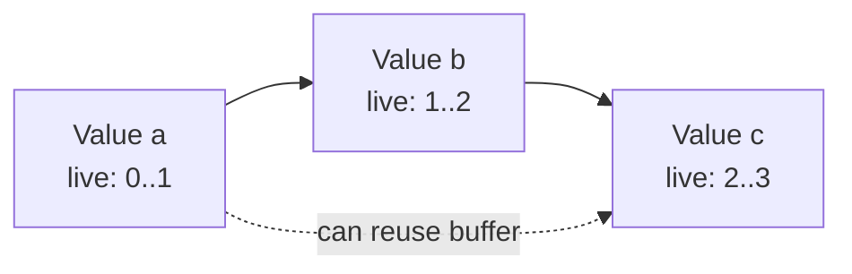

# MiniLLMEngine Design

MiniLLMEngine is a compact CPU-first LLM inference runtime. It borrows ideas from systems such as llama.cpp and ggml, but keeps the implementation intentionally small so each subsystem can be understood and tested independently.

The design goal is to demonstrate the core engineering concepts behind local LLM inference:

- graph construction and shape inference
- runtime tensor binding and memory ownership
- backend capability checks and kernel dispatch
- CPU transformer kernels
- GGUF model loading
- KV cache based prefill/decode generation

## System Overview



The runtime is separated into five layers:

| Layer | Responsibility |
|-------|----------------|
| Core | `Shape`, `DType`, `Device`, `Status`, and physical `Tensor` storage |
| Graph | Logical `Value` and `Node` descriptors plus graph validation and topological sort |
| Model | Transformer graph construction using `GraphBuilder` |
| Runtime | `RuntimeContext`, `CpuExecutor`, `CpuBackend`, `KernelRegistry`, CPU kernels, KV cache, sampler |
| IO | GGUF metadata parsing, tensor loading, weight-name mapping, and tokenizer |

## Core Types

### Shape

`Shape` stores tensor dimensions and uses `-1` for dynamic dimensions. Static allocation requires all dimensions to be known.

Important behavior:

- `numel()` rejects dynamic shapes.
- shape inference can propagate dynamic dimensions.
- runtime allocation happens only after graph shapes are concrete.

### Tensor

`Tensor` is the physical runtime container. It owns a CPU byte buffer and carries:

- name
- shape
- dtype
- device
- storage

The graph never stores tensor data. It only stores logical `Value` descriptors. Runtime data is attached later through `RuntimeContext`.

### Status

The project uses `Status` and `std::expected<T, Status>` instead of exceptions for normal error paths. This keeps graph construction, parsing, loading, and execution errors explicit.

## Graph IR

The graph IR is intentionally simple:

- `Value` describes a logical tensor.
- `Node` describes an operation with input and output `ValueId`s.
- `Graph` owns all values and nodes.
- `GraphBuilder` provides a typed construction API with shape inference.

Strong ID wrappers such as `ValueId` and `NodeId` avoid accidentally mixing raw integers with graph identifiers.

### Node Example

A `Linear` node is represented as:

```text
inputs:  [x, weight, optional_bias]
outputs: [y]
attrs:   none
op:      Linear
```

The output `Value` is created at build time after `infer_linear_shape()` validates the input and weight shapes.

## Graph Construction Flow



This makes graph construction fail early when shapes are incompatible. For example, `Linear` validates the input feature dimension and optional bias shape before adding the node.

## Execution Model

Execution is split into compile and run.

### Compile

`CpuExecutor::compile()`:

1. validates the graph
2. topologically sorts nodes
3. asks `CpuBackend` whether each op is supported
4. checks that a CPU kernel exists in `KernelRegistry`
5. stores the execution order

### Run

`CpuExecutor::run()`:

1. walks nodes in topological order
2. skips graph-only nodes such as `Input`, `Constant`, and `Output`
3. resolves the kernel function by `(DeviceType, OpType)`
4. runs the kernel with the current `RuntimeContext`
5. advances the shared KV cache once if the context requested it

The executor does not own tensor memory. It only reads bindings from `RuntimeContext`.

## RuntimeContext

`RuntimeContext` maps graph `ValueId`s to runtime `Tensor*`.

It supports two ownership modes:

- `bind(ValueId, Tensor*)` for externally owned tensors
- `emplace(ValueId, unique_ptr<Tensor>)` for context-owned tensors

It also owns optional runtime state:

- shared `KVCache`
- `kv_cache_advance_tokens`

The cache advance value is set by the caller:

```cpp
prefill_ctx.set_kv_cache_advance_tokens(prompt_len);
decode_ctx.set_kv_cache_advance_tokens(1);
```

After a successful graph run, `CpuExecutor` calls `advance_kv_cache_step()` exactly once. This avoids advancing once per attention layer.

## Graph Memory Planner

`MemoryPlanner` analyzes a graph without changing execution behavior. It answers a systems question that matters in inference runtimes: which intermediate tensors can share the same memory because their lifetimes do not overlap?

The planner currently targets CPU contiguous tensors and intentionally excludes:

- inputs
- constants and weights
- outputs by default
- dynamic-shape values
- non-CPU values
- KV cache storage

This keeps the first implementation predictable and easy to explain.

### Liveness Model

Each graph value gets a live range:

```text
first_node = node that produces the value
last_node  = last node that consumes the value
```

Inputs and constants are tracked for reporting but are not eligible for reuse. Output values are kept out of the reusable pool by default because callers usually need them after graph execution.



In this example `a` and `c` can share a buffer because `a.last_node < c.first_node`.

### Buffer Assignment

The planner uses a conservative greedy policy:

1. sort eligible ranges by first use
2. find an existing buffer with matching dtype/device
3. require `buffer.last_use < range.first_node`
4. require the buffer to be large enough
5. choose the smallest sufficient buffer
6. otherwise allocate a new logical buffer

The output is a `MemoryPlan` containing:

- one `MemoryLiveRange` per graph value
- reusable `MemoryBuffer` assignments
- naive aligned bytes
- planned peak bytes
- reuse saving ratio

Example report:

```text
Graph memory plan:
  values: 42
  eligible intermediates: 28
  skipped values: 14
  buffers: 11
  naive bytes: 50331648 (48.00 MiB)
  planned peak: 20971520 (20.00 MiB)
  reuse saving: 58.3%
```

This is not yet an arena allocator. It is the analysis layer that an arena allocator can consume later.

## CPU Backend

The CPU backend has two parts:

- `CpuBackend` declares supported ops.
- `KernelRegistry` maps ops to implementation functions.

The adapter layer in `cpu_kernel_adapter.cpp` converts graph-level tensors into raw pointers and shapes, checks dtype/allocation constraints, then calls the lower-level kernels in `cpu_kernels.cpp`.

Implemented CPU ops include:

- `Embedding`
- `MatMul`
- `Linear` with optional bias
- `RMSNorm`
- `QKNorm`
- `Add`
- `Mul`
- `SiLU`
- `SwiGLU`
- `RoPE`
- `Attention`
- `Softmax`
- `Reshape`
- `Transpose`

## GEMM Design

Transformer inference spends much of its CPU time in linear projections.

The common layout used by the project is:

```text
x:      [M, K]
weight: [N, K]
out:    [M, N]
```

This is computed as:

```text
out = x @ weight^T
```

The dedicated `sgemm_nt()` path is optimized for this layout and unrolls four output columns at a time. This avoids repeatedly scanning the same `A` row for adjacent output channels.

The benchmark executable measures this path:

```bash
./build/benchmark_cpu 1 2048 2048 20
```

## Attention And KV Cache

The attention kernel supports two runtime modes.

### No Cache

Without a cache, Q/K/V are reinterleaved into:

```text
Q: [heads, q_len, head_dim]
K: [heads, kv_len, head_dim]
V: [heads, kv_len, head_dim]
```

Then scaled dot-product attention is computed directly.

### Cache Path

With a cache, the runtime uses separate prefill and decode behavior.

Prefill:

1. K/V for the full prompt are copied into `KVCache`.
2. attention is computed over the prompt.
3. after the graph completes, the executor advances the cache by `prompt_len`.

Decode:

1. seq_len must be 1.
2. the new K/V row is appended at `cached_len`.
3. attention is computed over the full cached prefix plus the new token.
4. after the graph completes, the executor advances the cache by 1.

This keeps cache length updates outside individual attention nodes and prevents double-advancing when a graph has multiple transformer layers.

## GGUF Loading

The IO layer is split into:

- `GGUFParser`: reads file header, metadata, tensor infos, and raw tensor data.
- `WeightLoader`: maps GGUF tensor names to graph value names and converts supported formats to FP32 runtime tensors.
- `BPETokenizer`: experimental byte-level tokenizer initialized from GGUF metadata.

Currently supported weight data types:

- F32
- F16 to F32
- BF16 to F32

Quantized GGUF tensors are a future extension.

## Testing Strategy

The project uses small focused tests instead of relying only on end-to-end generation.

| Test | Purpose |
|------|---------|
| `test_shape` | shape and dynamic-dimension behavior |
| `test_tensor` | tensor byte sizing and CPU allocation |
| `test_graph` | graph validation and dumping |
| `test_graph_builder` | shape inference and builder-level validation |
| `test_cpu_kernels` | direct numerical checks for low-level CPU kernels |
| `test_runtime` | executor integration, KV cache, embedding, linear bias, graph ops |
| `test_gguf_parser` | GGUF parsing, metadata, tensor reading, F16/BF16 conversion |
| `test_memory_planner` | graph liveness, buffer reuse planning, skip reasons, report output |

The important split is:

- kernel tests catch numerical bugs in primitive ops
- runtime tests catch graph/context/executor integration bugs
- GGUF tests catch model loading regressions

## Current Limitations

MiniLLMEngine is intentionally CPU-first and small. It does not currently implement:

- quantized kernels such as Q8_0 or Q4_K
- mmap-based weight loading
- memory arena planning for intermediate tensors
- multi-threaded execution
- continuous batching
- multi-sequence KV cache slots
- production-grade tokenizer compatibility
- CUDA / Metal / Vulkan backends

These are valid future extensions, but they are not required for the project's current purpose.

## Design Tradeoffs

### Why Graph IR?

A graph IR makes it possible to separate model construction from execution. It also makes validation, backend checks, and future memory planning easier.

### Why CPU First?

CPU execution keeps the project portable and makes the core runtime easier to debug. It also creates room to discuss real systems topics such as cache behavior, SIMD, GEMM layout, and memory reuse.

### Why Keep Tensors Separate From Values?

`Value` describes what should exist. `Tensor` stores the data at runtime. This mirrors the separation between graph-level planning and execution-time memory.

### Why Executor-Driven KV Cache Advancement?

KV cache length is a graph-run-level state change, not an attention-node-level state change. Advancing in the executor means a multi-layer transformer can run all attention nodes and update the cache exactly once.

## Interview Talking Points

This project is useful to discuss:

- how a model graph is represented and validated
- how shape inference catches errors before execution
- how kernel dispatch works in a backend runtime
- why Linear commonly uses `A[M,K] x W[N,K]^T`
- how KV cache changes decode complexity
- how GGUF metadata and tensor loading fit into inference
- how to test numerical kernels separately from runtime integration

Good follow-up improvements:

- add Q8_0 weight loading and matmul
- add Release-mode benchmark tables
- add a simple memory planner
- add multi-threaded GEMM
- align an end-to-end Qwen3-0.6B run against llama.cpp for the first few generated tokens
