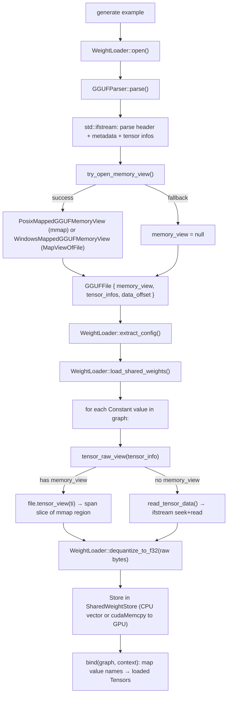
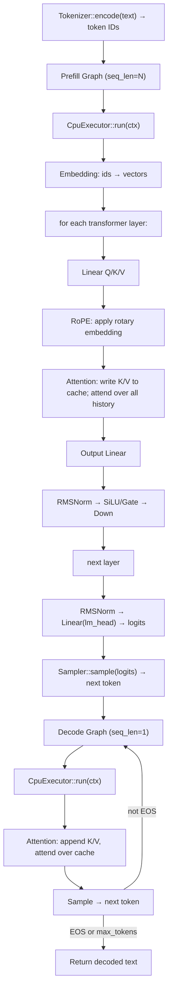
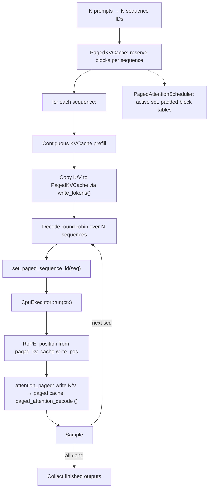
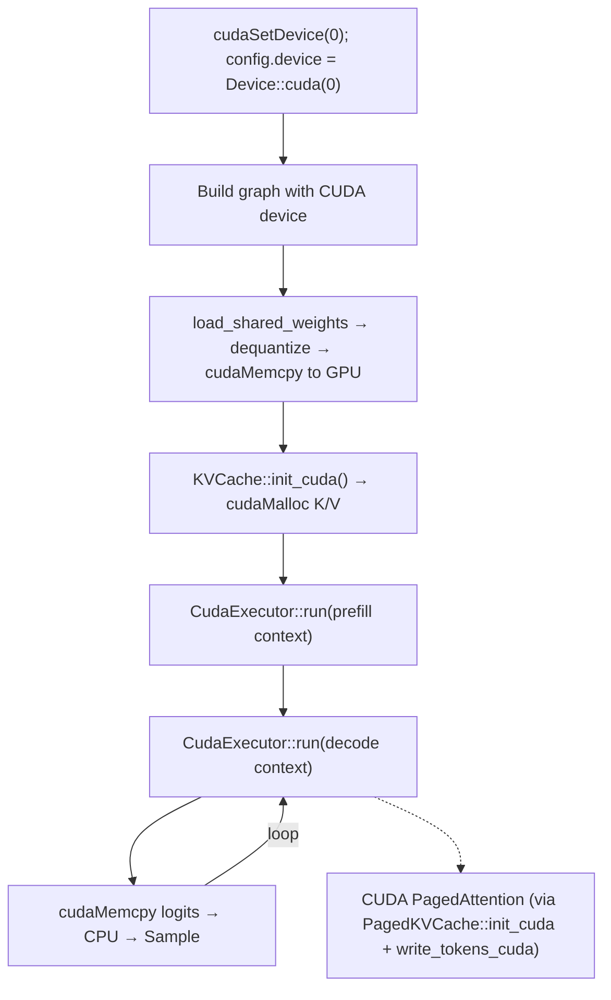
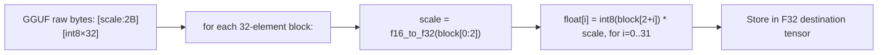
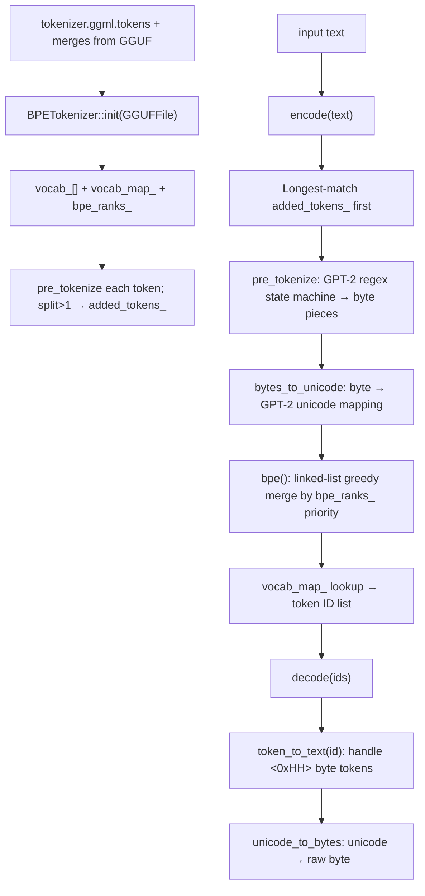

# MiniLLMEngine Runtime Flows

Key execution paths in MiniLLMEngine, from model file to generated token.

## Model Loading (mmap Fast Path)

**Key design**: `GGUFMemoryView` is a cross-platform read-only memory view. On Linux it uses `mmap()` with `MAP_PRIVATE`. On Windows it uses `CreateFileMappingA` + `MapViewOfFile`. The `SharedWeightStore` holds canonical tensors; `RuntimeContext` holds non-owning pointers.

## Single-Sequence Generation (CPU)

## Multi-Sequence Paged Generation

## CUDA Generation Path

## Quantized Weight Loading (Q8_0)

Q8_0 stores weights as 8-bit integers with a per-block 16-bit float scale. Dequantization happens once at load time; inference uses F32.

## Tokenizer Flow

